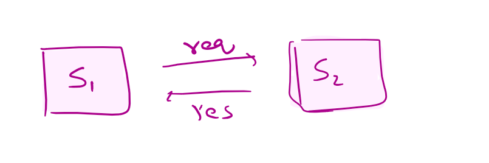

<details>
<summary>API</summary>

```text
API = Application Programming Interface

A contract that allows two systems to talk to each other.

```

</details>

<details>
<summary>HTTP 1 vs HTTP 2</summary>

```text
HTTP/2 improves performance by introducing multiplexing, header compression, and binary framing. Unlike HTTP 1.1,
 which processes requests sequentially, HTTP/2 allows multiple requests over a single TCP connection simultaneously, 
 reducing latency and improving throughput.
```


| Feature            | HTTP 1.1 | HTTP/2 |
| ------------------ | -------- | ------ |
| Format             | Text     | Binary |
| Multiplexing       | ❌ No     | ✅ Yes  |
| Header Compression | ❌ No     | ✅ Yes  |
| Performance        | Slower   | Faster |
| TCP Connections    | Many     | Single |
- Istio supports HTTP/2 internally.

```text
HTTP/2 helps mainly when multiple requests are sent to the same service because it allows multiplexing over a single connection. 
If requests go to different microservices, separate connections are still required,
 but HTTP/2 still improves performance through header compression and better connection management.
```

[http_https_http2_notes.md](http_https_http2_notes.md)
</details>


<details>
<summary>REST</summary>

[rest_api_design_guide.md](rest_api_design_guide.md)
</details>

- Types of APIs
  - REST API (most common)
  - SOAP API
  - gRPC
  - GraphQL
  - WebSocket API
  - Rpc
  - Webhooks