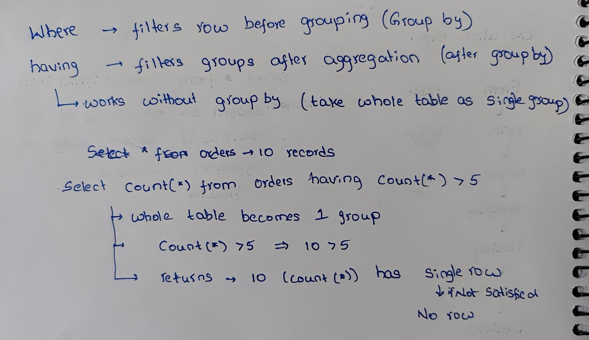
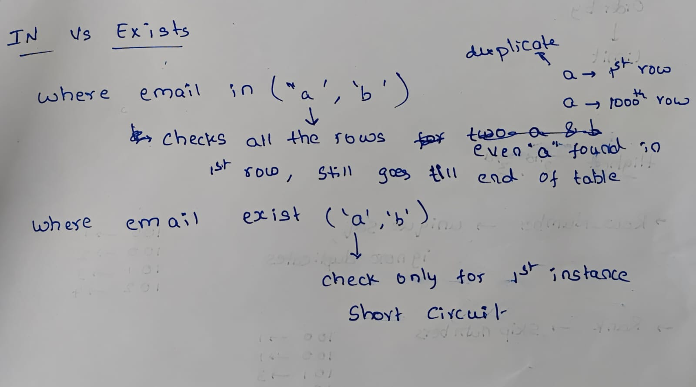

# SQL Interview Revision Notes (Service-Based Companies)

## 1. SQL Execution Order

1.  FROM
2.  JOIN
3.  WHERE
4.  GROUP BY
5.  HAVING
6.  SELECT
7.  DISTINCT
8.  ORDER BY
9.  LIMIT

------------------------------------------------------------------------

## 2. WHERE vs HAVING




``` sql
SELECT dept_id, COUNT(*)
FROM employees
GROUP BY dept_id
HAVING COUNT(*) > 1;
```

------------------------------------------------------------------------

## 3. JOIN Types

### INNER JOIN

Returns only matching rows from both tables.

### LEFT JOIN

Returns all rows from left table and matching rows from right table.

Important: Using WHERE condition on right table after LEFT JOIN may
behave like INNER JOIN.

------------------------------------------------------------------------

## 4. GROUP BY & Aggregation

-   COUNT(\*) → Counts all rows
-   COUNT(column) → Counts non-null values
-   SUM(), AVG(), MIN(), MAX()

Without GROUP BY: Entire table becomes one group.

------------------------------------------------------------------------

## 5. Window Functions

### sql for nth rank

```sql
SELECT DISTINCT salary
FROM employees
ORDER BY salary DESC
LIMIT 1 OFFSET 2;


```

### RANK()

Skips rank numbers when duplicates exist.

```sql
SELECT salary
FROM (
    SELECT salary,
           RANK() OVER (ORDER BY salary DESC) AS rnk
    FROM employees
) AS t
WHERE rnk = 3;

-- 100 → rank 1
-- 90  → rank 2
-- 90  → rank 2
-- 80  → rank 4
-- Result for rank = 3 → No rows
-- Because 80 got rank 4 due to duplicates
```

### DENSE_RANK()

Does not skip numbers. Best for Nth highest distinct value.

```sql
SELECT salary
FROM (
    SELECT salary,
           DENSE_RANK() OVER (ORDER BY salary DESC) AS dr
    FROM employees
) AS t
WHERE dr = 3;

-- 100 → dr = 1
-- 90  → dr = 2
-- 90  → dr = 2
-- 80  → dr = 3
-- Result = 80
-- (the third distinct highest value)
```

### ROW_NUMBER()

Assigns unique sequence number. Not suitable for distinct ranking.
ROW_NUMBER() returns a unique row number for each row.

```sql
SELECT salary
FROM (
    SELECT salary,
           ROW_NUMBER() OVER (ORDER BY salary DESC) AS rn
    FROM employees
) AS t
WHERE rn = 3;

-- If salaries are: 100, 90, 90, 80 → result = 90
-- (because duplicate values also count separately)
```

| Technique               | Distinct?      | Result with salaries: 100, 90, 90, 80 |
| ----------------------- | -------------- | ------------------------------------- |
| ROW_NUMBER              | ❌ not distinct | 90                                    |
| RANK                    | ❌ has gaps     | no row (80 is rank 4)                 |
| DENSE_RANK              | ✔ distinct     | 80                                    |
| LIMIT/OFFSET            | ❌ not distinct | 90                                    |
| DISTINCT + LIMIT/OFFSET | ✔ distinct     | 80                                    |


------------------------------------------------------------------------

## 6. Find Duplicate Records

``` sql
SELECT email
FROM employees
GROUP BY email
HAVING COUNT(*) > 1;
```

To fetch full records: Use subquery or JOIN.

------------------------------------------------------------------------

## 7. 
  ###  IN vs  EXISTS

   

  ### NOT IN vs NOT EXISTS

  NOT IN:   Fails if subquery returns NULL, Can return no rows unexpectedly                          
  NOT EXISTS: Safe with NULL , Reliable
    
     

Prefer NOT EXISTS for anti-join logic.

------------------------------------------------------------------------

## 8. Index Concepts

### What is Index?

Data structure that improves read performance but slows writes.

### Composite Index Rule

Index (A, B, C)

Efficient: - WHERE A = ? - WHERE A = ? AND B = ? - WHERE A = ? AND B = ?
AND C = ?

Not Efficient: - WHERE B = ? - WHERE C = ? - WHERE A = ? AND C = ?

### **Equality → Range → Order Rule**

Best pattern:

``` sql
WHERE A = ?
AND B > ?
ORDER BY B
```

Index: (A, B)

------------------------------------------------------------------------

## 9. DELETE vs TRUNCATE
| DELETE                          | TRUNCATE                   |
|---------------------------------|----------------------------|
| Can use WHERE                   | Removes all rows           |
| Can be rolled back              | Usually auto-commit        |
| Fires triggers                  | Does not fire triggers     |
| Slower                          | Faster                     |
| Does not reset auto increment   | Resets auto increment      |


------------------------------------------------------------------------

## 10. Deadlock

Occurs when two transactions wait for each other's locks. Database
detects cycle and rolls back one transaction.

------------------------------------------------------------------------

## 11. Normalization

Purpose: - Reduce redundancy - Prevent update anomalies

Over-normalization: - Too many joins - Performance degradation

------------------------------------------------------------------------

## 12. Slow Query Checklist

-   Check execution plan
-   Check index usage
-   Avoid SELECT \*
-   Reduce joins if possible
-   Check low selectivity indexes
-   Avoid functions on indexed columns
-   Verify composite index order

------------------------------------------------------------------------

# End of Revision Notes
