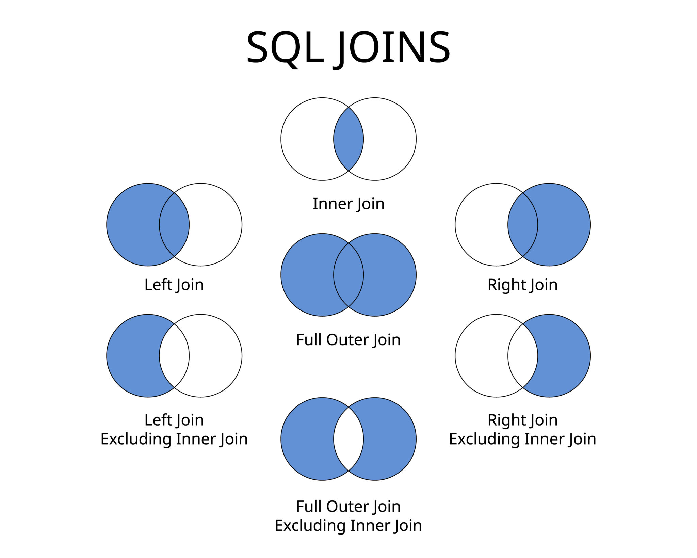

# SQL Queries & Internal Implementation (10+ Years Experience)

This guide covers **ALL major SQL query types** and explains **how databases execute them internally**. It is written at a **senior / architect level** and aligns with **real interview expectations**.

---

### Databases
```sql
| Type                 | Data Format    | Structure       | Example DBs                        | Best Use Cases             | Real Industry Example     | When YOU should use        |
| -------------------- | -------------- | --------------- | ---------------------------------- | -------------------------- | ------------------------- | -------------------------- |
| **Relational (SQL)** | Rows & Columns | Fixed schema    | MySQL, PostgreSQL, Oracle Database | Transactions, banking, ERP | Payments, Orders, Billing | Money + consistency needed |
| **Document**         | JSON / BSON    | Schema-less     | MongoDB, Azure Cosmos DB           | Profiles, catalogs, logs   | E-commerce product data   | Flexible/changing fields   |
| **Key-Value**        | key → value    | No schema       | Redis, Amazon DynamoDB             | Cache, sessions, OTP       | Login sessions            | Ultra-fast lookup          |
| **Column-Family**    | Wide columns   | Column groups   | Apache Cassandra, Apache HBase     | Big data, time-series      | IoT sensors, metrics      | Massive scale writes       |
| **Graph**            | Nodes & Edges  | Relationships   | Neo4j, Amazon Neptune              | Social, fraud detection    | Friend recommendations    | Complex relationships      |
| **Time-Series**      | Timestamp data | Append-only     | InfluxDB, TimescaleDB              | Monitoring, metrics        | DevOps dashboards         | Logs/Prometheus metrics    |
| **Search DB**        | Indexed docs   | Full-text index | Elasticsearch                      | Search, analytics          | Product search            | Text search required       |

```

### ACID

```sql
| Property        | One-line Meaning                                 | Simple Explanation                              | Real-life Example                                         | What happens if missing          |
| --------------- | ------------------------------------------------ | ----------------------------------------------- | --------------------------------------------------------- | -------------------------------- |
| **Atomicity**   | All or nothing                                   | Transaction fully completes OR fully rolls back | Money transfer ₹1000: debit + credit both succeed or none | Money debited but not credited ❌ |
| **Consistency** | Data stays valid                                 | Rules/constraints always satisfied              | Balance cannot be negative                                | Corrupt/invalid data stored ❌    |
| **Isolation**   | Transactions don’t see each other’s partial work | Parallel users behave like sequential           | 2 users booking same seat → only one succeeds             | Dirty/duplicate data ❌           |
| **Durability**  | Once committed, always saved                     | Data survives crash/power loss                  | After payment success, record stays even if DB crashes    | Data lost after restart ❌        |

```

```
| Property    | Interview 5-word answer | 
| ----------- | ----------------------- |
| Atomicity   | All or rollback         |
| Consistency | Valid state always      |
| Isolation   | No interference         |
| Durability  | Permanent after commit  |

```
```sql
| Scenario                | ACID property used |
| ----------------------- | ------------------ |
| @Transactional method   | Atomicity          |
| DB constraints          | Consistency        |
| Multiple users updating | Isolation          |
| After commit logs       | Durability         |

```


### DDL,DML,DCL,TCL
```text
| Type    | Full Form                    | Works On        | Purpose (1-line)          | Auto Commit? | Examples               |
| ------- | ---------------------------- | --------------- | ------------------------- | ------------ | ---------------------- |
| **DDL** | Data Definition Language     | Table structure | Define/modify schema      | ✅ Yes        | CREATE, ALTER, DROP    |
| **DML** | Data Manipulation Language   | Table data      | Insert/update/delete rows | ❌ No         | INSERT, UPDATE, DELETE |
| **DCL** | Data Control Language        | Permissions     | Access control            | ✅ Yes        | GRANT, REVOKE          |
| **TCL** | Transaction Control Language | Transactions    | Manage commits/rollbacks  | ❌ No         | COMMIT, ROLLBACK       |

```

```DDL
| Command  | Purpose              | Example                           |
| -------- | -------------------- | --------------------------------- |
| CREATE   | Create table/db      | `CREATE TABLE emp(id INT);`       |
| ALTER    | Modify structure     | `ALTER TABLE emp ADD salary INT;` |
| DROP     | Delete object        | `DROP TABLE emp;`                 |
| TRUNCATE | Remove all rows fast | `TRUNCATE TABLE emp;`             |

```
```DML
| Command | Purpose     | Example                            |
| ------- | ----------- | ---------------------------------- |
| INSERT  | Add rows    | `INSERT INTO emp VALUES(1,'Ram');` |
| UPDATE  | Modify rows | `UPDATE emp SET salary=5000;`      |
| DELETE  | Remove rows | `DELETE FROM emp WHERE id=1;`      |
| SELECT  | Read rows   | `SELECT * FROM emp;`               |

```
```DCL
| Command | Purpose           | Example                            |
| ------- | ----------------- | ---------------------------------- |
| GRANT   | Give permission   | `GRANT SELECT ON emp TO user1;`    |
| REVOKE  | Remove permission | `REVOKE INSERT ON emp FROM user1;` |

```

```TCL
| Command         | Purpose          | Example                                           |
| --------------- | ---------------- | ------------------------------------------------- |
| COMMIT          | Save changes     | `COMMIT;`                                         |
| ROLLBACK        | Undo changes     | `ROLLBACK;`                                       |
| SAVEPOINT       | Partial rollback | `SAVEPOINT s1;`                                   |
| SET TRANSACTION | Isolation level  | `SET TRANSACTION ISOLATION LEVEL READ COMMITTED;` |

```

### special operators

```text
| Operator    | What it does          | Where to use        | Syntax Example                       |
| ----------- | --------------------- | ------------------- | ------------------------------------ |
| IN          | Match multiple values | Multi-choice filter | `WHERE dept IN (10,20)`              |
| BETWEEN     | Range (inclusive)     | Salary/date ranges  | `WHERE salary BETWEEN 3000 AND 6000` |
| LIKE        | Pattern search        | Name search         | `WHERE name LIKE 'R%'`               |
| IS NULL     | Check null            | Missing values      | `WHERE mgr IS NULL`                  |
| IS NOT NULL | Not null              | Existing values     | `WHERE mgr IS NOT NULL`              |
| EXISTS      | Check rows exist      | Subqueries (fast)   | `WHERE EXISTS (SELECT 1 FROM dept)`  |
| ANY         | Compare any value     | Subqueries          | `salary > ANY (subquery)`            |
| ALL         | Compare all values    | Subqueries          | `salary > ALL (subquery)`            |
| DISTINCT    | Remove duplicates     | Unique values       | `SELECT DISTINCT dept FROM emp`      |
| AS          | Alias column/table    | Rename              | `SELECT name AS emp_name`            |

```

```text
| Operator       | What it does                | Where to use  | Syntax Example                                |
| -------------- | --------------------------- | ------------- | --------------------------------------------- |
| UNION          | Combine + remove duplicates | Merge results | `SELECT id FROM A UNION SELECT id FROM B`     |
| UNION ALL      | Combine + keep duplicates   | Faster merge  | `SELECT id FROM A UNION ALL SELECT id FROM B` |
| INTERSECT      | Common rows                 | Matching data | `SELECT id FROM A INTERSECT SELECT id FROM B` |
| EXCEPT / MINUS | Subtract rows               | Differences   | `SELECT id FROM A EXCEPT SELECT id FROM B`    |

```

### case
```text
CASE
   WHEN condition THEN result
   WHEN condition THEN result
   ELSE result
END

```

```text
SELECT name,
CASE
   WHEN salary > 8000 THEN 'High'
   WHEN salary > 4000 THEN 'Medium'
   ELSE 'Low'
END AS salary_band
FROM emp;

```


### CTE (Common Table Expression)
CTE is a temporary named result set that you can reuse inside a query.
Temporary table inside query
- simple query
- resuable
```sql
WITH
total_sal AS (
   SELECT dept_id, SUM(salary) total FROM emp GROUP BY dept_id
),
high_dept AS (
   SELECT * FROM total_sal WHERE total > 20000
)
SELECT * FROM high_dept;

```


### copy table
```sql
-- create table and copy all values
create table empCopy as select * from emp

-- create table without data
create table empCopy1 as select * from emp where 1=0

-- insert all data
insert into empcopy1 select * from emp

-- insert few columns
insert into empcopy1 (empno,ename) select empno,ename from emp


```

### count

```sql
-- fast no null checks all records including nulls
select count(*) from user;

-- slow check null value for each records and gives non-null count
select count(column_name) from user;

-- same as count(*) but takes only one coulumn may be little bit fast compare to count(*)
select count(1) from user;
```


### ExecutionOrder
```text
| Step | Clause       | What it does      | Example                |
| ---- | ------------ | ----------------- | ---------------------- |
| 1    | FROM         | Choose tables     | `FROM emp`             |
| 2    | JOIN         | Join tables       | `JOIN dept ON ...`     |
| 3    | WHERE        | Filter rows       | `WHERE salary > 5000`  |
| 4    | GROUP BY     | Group rows        | `GROUP BY dept_id`     |
| 5    | HAVING       | Filter groups     | `HAVING COUNT(*) > 2`  |
| 6    | SELECT       | Pick columns      | `SELECT name, salary`  |
| 7    | DISTINCT     | Remove duplicates | `SELECT DISTINCT dept` |
| 8    | ORDER BY     | Sort results      | `ORDER BY salary DESC` |
| 9    | LIMIT/OFFSET | Restrict rows     | `LIMIT 10`             |

```

### query optimization

```text
| Technique                  | What it does          | Where to use        | Example / Tip                         |
| -------------------------- | --------------------- | ------------------- | ------------------------------------- |
| Indexing                   | Faster search         | WHERE/JOIN columns  | `CREATE INDEX idx_sal ON emp(salary)` |
| Use EXPLAIN                | See execution plan    | Debug slow queries  | `EXPLAIN SELECT * FROM emp`           |
| Avoid SELECT *             | Reduce I/O            | Large tables        | Select needed columns only            |
| Proper WHERE filters       | Reduce rows early     | All queries         | Filter ASAP                           |
| Use JOIN not subquery      | Faster execution      | Large data          | Replace nested queries                |
| Use EXISTS not IN          | Faster subquery check | Big datasets        | `WHERE EXISTS (...)`                  |
| Limit rows                 | Pagination            | APIs                | `LIMIT 20`                            |
| Composite index            | Multi-column filters  | WHERE col1 AND col2 | `(dept_id, salary)`                   |
| Avoid functions on columns | Use index properly    | WHERE clause        | ❌ `WHERE YEAR(date)`                  |
| Normalize schema           | Remove duplication    | Design phase        | 3NF                                   |
| Denormalize for reads      | Reduce joins          | Reports             | precomputed data                      |
| Caching                    | Avoid DB hits         | Repeated reads      | Redis                                 |

```

### limit vs offset
```sql
 EXPLAIN ANALYZE select * from emp limit 2
 
 -- -> Limit: 2 row(s)  (cost=2.65 rows=2) (actual time=0.070..0.073 rows=2 loops=1)
 --    -> Table scan on emp  (cost=2.65 rows=24) (actual time=0.068..0.071 rows=2 loops=1)
```
stops after 2 records

```sql
 EXPLAIN ANALYZE select job from emp limit 2 offset 18
 -- -> Limit/Offset: 2/18 row(s)  (cost=2.65 rows=2) (actual time=0.064..0.065 rows=2 loops=1)
   --  -> Table scan on emp  (cost=2.65 rows=24) (actual time=0.053..0.061 rows=20 loops=1)
```
actual time=0.053..0.061 rows=20 loops=1  --> 18 offset + 2 limit 

use where clause for pagination dont use offset


### nth highest salary
```sql

SELECT salary
FROM emp e1
WHERE (
    SELECT COUNT(DISTINCT salary)
    FROM emp e2
    WHERE e2.salary > e1.salary
) = 1;

-- ❌ Slow  Runs subquery per row

```
```sql
SELECT salary
FROM (
    SELECT salary,
           DENSE_RANK() OVER (ORDER BY salary DESC) rnk
    FROM emp
) t
WHERE rnk = 2;

```

## 1. SELECT (Read Queries)
### 1.1 Basic SELECT
```sql
SELECT id, name FROM users WHERE age > 30;
```
**Internals:**
- Parser builds AST
- Optimizer chooses index scan or full table scan
- Executor fetches rows


## How an Index References a Table

```
INDEX (age)                 TABLE (users)
--------------------        -----------------------
age | row_pointer   -----> row_id | id | name | age
--------------------        -----------------------
```

### Explanation
- The **index** stores only:
    - Indexed column value (`age`)
    - A **row pointer** (ROWID / primary key / page+offset)
- The **table** stores the full row data
- Index does **NOT** duplicate the table
- Index allows fast lookup by jumping directly to rows


---

### 1.2 WHERE Clause
```sql
SELECT * FROM orders WHERE status = 'PAID';
```
**Internals:**
- Predicate pushed down
- Index seek if index exists
- Row filtering happens before projection

---

### 1.3 ORDER BY
```sql
SELECT * FROM users ORDER BY created_at DESC;
```
**Internals:**
- Uses index order if available
- Else performs external sort (memory + disk)

---

### 1.4 LIMIT / OFFSET
```sql
SELECT * FROM users ORDER BY id LIMIT 10 OFFSET 1000;
```
**Internals:**
- OFFSET rows still scanned
- LIMIT stops row emission early
- Keyset pagination preferred

```aiignore
instead of->
LIMIT 10 OFFSET 1000

use->
WHERE id > last_seen_id
ORDER BY id
LIMIT 10;

```

---

## 2. INSERT (Write Queries)
```sql
INSERT INTO users (id, name) VALUES (1, 'A');
```
**Internals:**
- WAL (Write Ahead Log)
- Row written to data page
- Index entries updated

---

### 2.1 Bulk Insert
```sql
INSERT INTO users SELECT * FROM temp_users;
```
**Internals:**
- Batch execution
- Reduced WAL flushes
- Faster than row-by-row

---

## 3. UPDATE
```sql
UPDATE accounts SET balance = balance - 100 WHERE id = 10;
```
**Internals:**
- Row-level lock acquired
- Old version stored (MVCC)
- New version written

---

## 4. DELETE
```sql
DELETE FROM sessions WHERE expired = true;
```
**Internals:**
- Logical delete (MVCC)
- Space reclaimed later by vacuum / purge

---

## 5. JOINS (CRITICAL)




### 5.1 INNER JOIN
```sql
SELECT * FROM orders o JOIN users u ON o.user_id = u.id;
```
**Internals:**
- Nested Loop Join
- Hash Join
- Merge Join

---

### 5.2 LEFT JOIN
```sql
SELECT * FROM users u LEFT JOIN orders o ON u.id = o.user_id;
```
**Internals:**
- Preserves left table rows
- NULL padding for missing matches

---

## 6. GROUP BY & Aggregation
```sql
SELECT status, COUNT(*) FROM orders GROUP BY status;
```
**Internals:**
- Hash aggregation
- Sort-based aggregation

---

## 7. HAVING
```sql
SELECT status FROM orders GROUP BY status HAVING COUNT(*) > 10;
```
**Internals:**
- Aggregation first
- HAVING applied after GROUP BY

---

## 8. SUBQUERIES

```text

DEPTNO	DNAME	     LOC
10	    ACCOUNTING	NEW YORK
20	    RESEARCH	DALLAS

EMPNO   ENAME   JOB         MGR     HIREDATE    SAL     DEPTNO
7369	SMITH	CLERK	    7902	1980-12-17	50	    20
7499	ALLEN	SALESMAN	7698	1981-02-20	1600	30
7902	WARD	SALESMAN	7698	1981-02-22	1250	30


```

### single row sub-query

```sql
select * from emp where deptno = (select deptno from dept where dname='sales')

-- join version                  
select e.* from emp e left  join dept d on  e.deptno=d.deptno
where d.dname='sales'
```

### multi row subquery
```sql
select * from emp where deptno in (select deptno from dept where dname='sales' or dname= 'RESEARCH')
-- join version
-- no order by inside sub queries use outside
select e.* from emp e left  join dept d on  e.deptno=d.deptno
where d.dname='sales' or dname='RESEARCH'
```

### correlation sub-query

```sql
-- get all the employess whose salaray greater than manager's salary
select * from emp e where e.sal > (select sal from emp m where e.mgr=m.empno)

-- join version, use self join
select e.* from emp e join emp m on e.mgr=m.empno
where e.sal>m.sal

```
### sub-query in select clause

```sql
-- get employess and thier manager names

select e.ename, (select m.ename from emp m where e.mgr=m.empno) as manager_name from emp e

-- use joins

select e.ename, m.ename from emp e join emp m on e.mgr=m.empno 
```


### 8.1 Correlated Subquery
```sql
SELECT * FROM orders o WHERE amount > (
  SELECT AVG(amount) FROM orders WHERE user_id = o.user_id
);
```
**Internals:**
- Executed per row (slow)
- Often rewritten as JOIN by optimizer

---

## 9. EXISTS vs IN
```sql
SELECT * FROM users u WHERE EXISTS (
  SELECT 1 FROM orders o WHERE o.user_id = u.id
);
```
**Internals:**
- EXISTS short-circuits
- IN materializes set

---

## 10. INDEXES (VERY IMPORTANT)

### 10.1 B-Tree Index
```sql
CREATE INDEX idx_users_age ON users(age);
```
**Internals:**
- Balanced tree
- O(log N) lookup

---

### 10.2 Composite Index
```sql
CREATE INDEX idx_users_age_city ON users(age, city);
```
**Internals:**
- Leftmost prefix rule

---

## 11. TRANSACTIONS
```sql
BEGIN;
UPDATE accounts SET balance = balance - 100;
COMMIT;
```
**Internals:**
- WAL logging
- Atomic commit
- Rollback via undo logs

---

## 12. ISOLATION LEVELS
| Level | Phenomena |
|-----|---------|
| Read Uncommitted | Dirty reads |
| Read Committed | Non-repeatable reads |
| Repeatable Read | Phantom reads |
| Serializable | Full isolation |

---

## 13. LOCKING

### Row-level locks
```sql
SELECT * FROM orders WHERE id = 10 FOR UPDATE;
```
**Internals:**
- Prevents concurrent updates
- Used in money transfer systems

---

## 14. MVCC (MULTI VERSION CONCURRENCY CONTROL)
**How it works:**
- Readers see snapshot
- Writers create new row version
- No read locks

---

## 15. EXPLAIN / QUERY PLAN
```sql
EXPLAIN ANALYZE SELECT * FROM users WHERE age > 30;
```
**Internals:**
- Shows cost-based decisions
- Actual vs estimated rows

---

## 16. PERFORMANCE ANTI-PATTERNS
❌ SELECT *
❌ OFFSET pagination
❌ Functions on indexed columns
❌ Missing indexes on JOIN keys

---

## 17. SCALING CONCEPTS
- Read replicas
- Sharding
- Partitioning
- Caching (Redis)

---

## 18. INTERVIEW GOLD QUESTIONS
- How index selectivity affects plans
- Why COUNT(*) is fast
- Difference between logical and physical delete
- How deadlocks occur
- How databases ensure durability

---

## FINAL SENIOR MENTAL MODEL
```
SQL = declarative
Optimizer = decision maker
Indexes = performance
Transactions = correctness
```

---

If you want next:
- PostgreSQL vs MySQL internals
- Real EXPLAIN plan walkthroughs
- SQL tuning checklist
- Database interview Q&A (10+ yrs)

