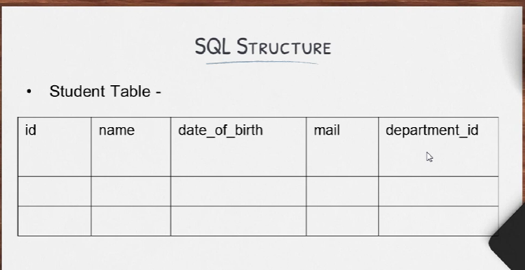
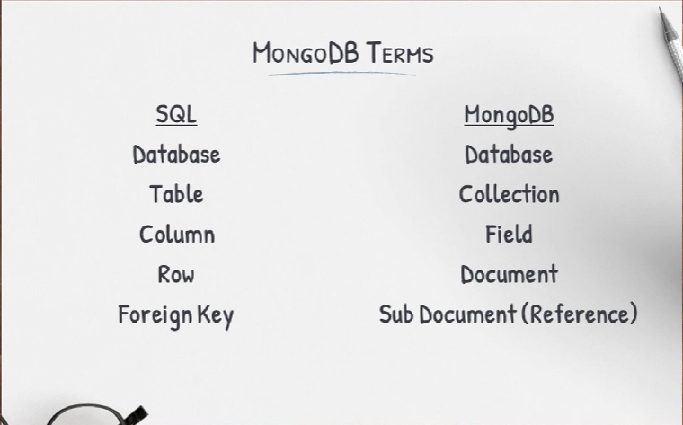
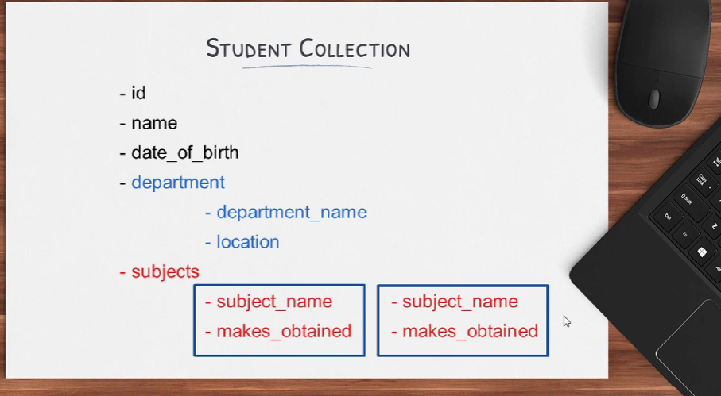
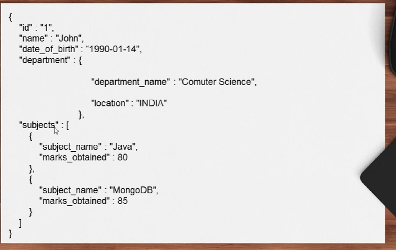

Mongo db

- WHAT IS MONGODB ?
- MongoDB is document based NoSQL Database. Most widely used NoSQL Database in the world.
- Stores Data in JSON like documents. (BSON)
- Very flexible structure to store the data.
- Large amount of data can be easily managed.
- It is being used by well known companies like Google, Adobe,Cisco, SAP, eBay.

mongo terms

- 
- 
- 
- 

TODO : READ WRITE UPDATE DELETE

