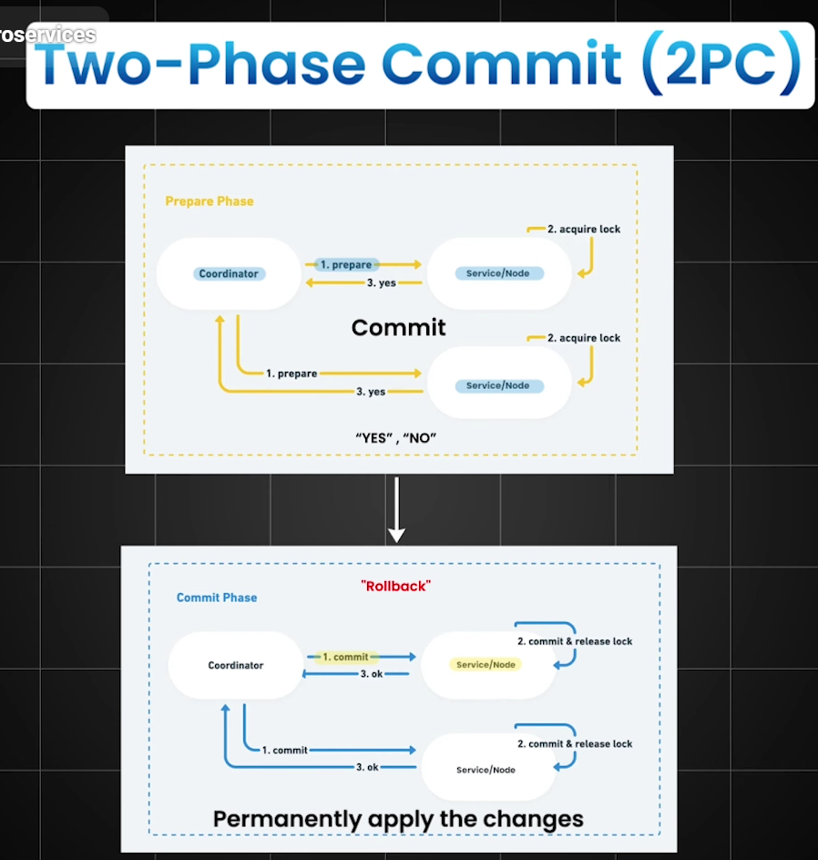

# Data Consistency in Microservices Architecture

## Why Data Consistency is Challenging

In a monolithic architecture:
- Single database
- ACID transactions
- Easy rollback

In microservices:
- Each service owns its own database
- No global transactions
- Network failures and partial failures are common

Therefore, we use patterns like:
- Two Phase Commit (2PC)
- Saga Pattern (Orchestration and Choreography)
- Outbox Pattern
- Retries and Idempotency

---

# 1. Two-Phase Commit (2PC)

## What is 2PC?

Two Phase Commit is a distributed transaction protocol that ensures **all participating services either commit or rollback together**.

## Steps

### Phase 1 – Prepare Phase
1. Coordinator asks all services to prepare.
2. Each service locks resources and replies YES/NO.

### Phase 2 – Commit Phase
- If all YES → Commit
- If any NO → Rollback

## Example

Order Service → Payment Service → Inventory Service

Coordinator:
- Ask all to prepare
- If all succeed → Commit

## Advantages
- Strong consistency
- ACID guarantee

## Disadvantages
- Blocking
- Slow
- Coordinator failure risk
- Not cloud-friendly

## When Used
- Banking systems (rare cases)
- Legacy distributed systems

---

# 2. Saga Pattern

Saga is a sequence of **local transactions** where each step has a **compensating transaction**.

Example:
1. Create Order
2. Reserve Inventory
3. Process Payment

If payment fails:
- Cancel Order
- Release Inventory

---

## Saga Types

# 2.1 Choreography-Based Saga

Services communicate using events.

Flow:
OrderCreated → InventoryReserved → PaymentProcessed

### Example Flow
1. Order Service publishes OrderCreated
2. Inventory Service consumes and reserves stock
3. Payment Service processes payment

### Advantages
- Decoupled
- Scalable

### Disadvantages
- Hard to debug
- Complex event chains

---

# 2.2 Orchestration-Based Saga

A central orchestrator controls the flow.

Flow:
Orchestrator → Order Service → Inventory → Payment

### Example
Orchestrator:
- Call Order Service
- Call Inventory Service
- Call Payment Service
- Trigger compensation if failure

### Advantages
- Easier to manage
- Clear control flow

### Disadvantages
- Single point of coordination

---

# 3. Outbox Pattern

## Problem Solved

If DB commit succeeds but event publishing fails:
- Other services never receive event
- System becomes inconsistent

## Solution

Within a single transaction:
1. Save business data
2. Save event to OUTBOX table
3. Commit

Later:
- Background job publishes events from Outbox

---

## Example

Tables:

Orders Table
- id
- status

Outbox Table
- id
- event_type
- payload
- status

---

## Flow

1. Save order
2. Insert outbox event
3. Commit transaction
4. Background worker publishes event
5. Mark event as SENT

---

## Publishing Strategies

### Polling
- Scheduler reads Outbox periodically

### CDC (Change Data Capture)
- Tools like Debezium stream DB changes to Kafka

---

# 4. Retries

Retries handle temporary failures like:
- Network issues
- Service unavailability

## Retry Strategies
- Fixed delay
- Exponential backoff
- Circuit breaker integration

Example (Pseudo):
Retry 3 times with exponential backoff.

---

# 5. Idempotency

Idempotency ensures that repeating a request does not cause duplicate effects.

Example:
Payment request retried:
- Must not charge twice

## Techniques

### Idempotency Key
Client sends:
Idempotency-Key: 12345

Server:
- Store key
- Ignore duplicates

### Unique Constraints
Transaction ID unique in database.

---

# 6. Real Industry Architecture

Typical setup:
- Spring Boot services
- Kafka or RabbitMQ
- PostgreSQL
- Saga orchestration
- Outbox pattern
- Retry with backoff
- Idempotent consumers

---

# 7. Comparison Table

| Pattern | Consistency | Performance | Complexity |
|--------|--------|--------|--------|
| 2PC | Strong | Slow | High |
| Saga | Eventual | High | Medium |
| Outbox | Reliable events | High | Medium |
| Retry/Idempotency | Reliability | High | Low |

---

# 8. Interview Questions

1. Why is 2PC rarely used in microservices?
2. Difference between choreography and orchestration?
3. What problem does Outbox solve?
4. Why must consumers be idempotent?
5. What is eventual consistency?

---

# 9. Golden Interview Answer

"In microservices, data consistency is typically maintained using Saga patterns, Outbox pattern for reliable event publishing, retries with exponential backoff, and idempotency to prevent duplicate processing instead of distributed transactions like 2PC."
