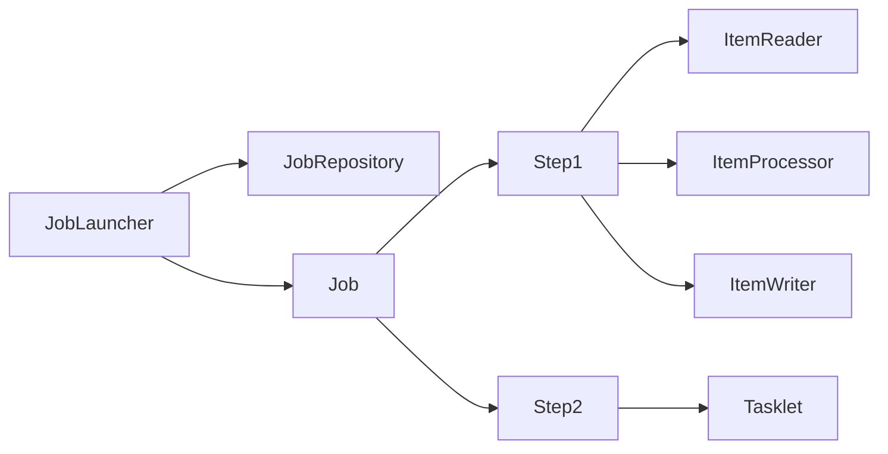
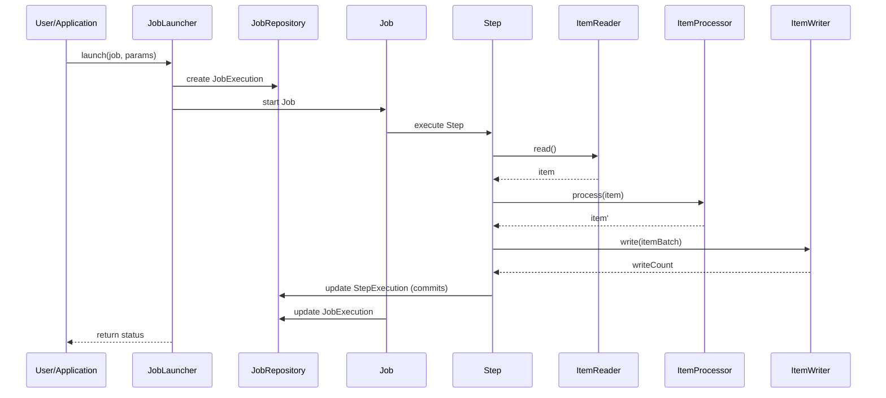

# Spring Batch Notes


## Executive Summary

-  Spring Batch is a robust Java framework for processing large volumes of data in batch jobs
-  A *Job* encapsulates one or more *Step*s, each performing a portion of the work. 
-  Steps can be **chunk-oriented** (read/process/write in transactions) or simple **tasklets**.
-  Key abstractions include
    - **JobRepository**  ---> (persists metadata)
    - **JobLauncher**    ---> (starts jobs),
    - **JobExecution** and **StepExecution** ---> runtime objects like .
-  Spring Boot auto-configures Batch with minimal setup (just add `spring-boot-starter-batch`), whereas traditional Spring requires explicit bean definitions.
-  Spring Batch supports fault tolerance (retry/skip),
-  parallel processing (multi-thread, partitioning, remote chunking),
-  scheduling (using Spring’s `@Scheduled` or Quartz), and 
-  observability via Micrometer metrics. 

## Core Concepts

- **Job**: A container of steps, defined by a name and configuration. It is restartable by default and has a lifecycle managed by the **JobLauncher**. A Job groups related work into steps (ordering, conditional flow).  
- **Step**: A phase in a job, either *tasklet* or *chunk*-oriented. Tasklet steps run a single callback; chunk steps loop `read`→`process`→`write` repeatedly. Each step has its own **StepExecution** tracking status and counts.  
- **JobInstance & JobExecution**: A JobInstance is a logical run identified by Job name and parameters. Each launch produces a JobExecution (with status, start/end times) linked to the instance. Changing JobParameters creates a new JobInstance. The JobRepository stores these details.  
- **JobParameters**: Immutable parameters (e.g. dates, IDs) that identify a job instance. They must be provided on launch and determine restartability.  
- **ExecutionContext**: A key–value store for a JobExecution or StepExecution, used to save state between restarts or communicate between steps.  
- **ItemReader/Processor/Writer**: Interfaces for chunk steps. The **ItemReader** returns one item at a time (or null when done). The **ItemProcessor** optionally transforms or filters items (returning null to drop an item)【11†L872-L880】. The **ItemWriter** takes a list of items (a chunk) and writes them (e.g. to DB or file).  
- **Listeners**: Hooks to intercept events. Examples include `JobExecutionListener`, `StepExecutionListener`, and `SkipListener`. They allow custom logic before/after job or step, or on item read/process/write, useful for logging or error handling.  
- **Fault Tolerance**: Configure skip/retry in chunk steps with `faultTolerant()`. For example, `.skipLimit(10).skip(SomeException.class)` skips bad items up to a limit, while `.retryLimit(3).retry(RetriableException.class)` retries failures.  
- **Transactions**: Each chunk is committed in a transaction. You can customize propagation, isolation, and timeout via `transactionAttribute(...)` on the step【60†L153-L162】. By default, propagation=REQUIRED and isolation=DEFAULT.  
- **Parallel Processing**: Spring Batch supports multithreading within a step or splitting steps across threads/processes. **Multi-threaded steps** add a `TaskExecutor` to process chunks in parallel【47†L15-L23】. **Partitioning** breaks one step into partitions with independent execution (possibly remote)【48†L47-L55】. **Remote chunking** (Fig. 1) uses messaging to distribute chunks to worker processes.  
- **Metadata**: The batch meta-data (job executions, step executions, contexts) are stored in a relational database via `JobRepository`. Spring provides SQL scripts to create tables (e.g. `schema-h2.sql`). This enables restartability and monitoring.

## Setup & Dependencies

- **Spring Boot vs Spring Framework**: With Spring Boot (3.x), add the Batch starter (`spring-boot-starter-batch`) and a database driver; 
  - Boot auto-configures the JobRepository, transaction manager, and defaults.
  - In plain Spring, use `@EnableBatchProcessing` or XML `<batch:job-repository>` and provide a DataSource/TxManager manually.
  - Boot also initializes the schema (`spring.batch.initialize-schema=always`) and launches jobs on startup by default.  
- **Maven/Gradle**: Example Maven dependencies:
  ```xml
  <dependency>
    <groupId>org.springframework.boot</groupId>
    <artifactId>spring-boot-starter-batch</artifactId>
    <version>3.6.0</version> <!-- or latest -->
  </dependency>
  <dependency>
    <groupId>com.h2database</groupId>
    <artifactId>h2</artifactId>
    <scope>runtime</scope>
  </dependency>
  ```
    
- **Schema Initialization**: Spring Batch provides SQL scripts (`schema-mysql.sql`, etc.) under `org.springframework.batch.core`. In Spring Boot, set `spring.batch.initialize-schema=always` or run the script via `<jdbc:initialize-database>` for non-Boot.  
- **Application Properties/YAML**: Typical settings in `application.yml` (example below) configure the DataSource and batch behavior (disable job auto-run if desired).  
- **Version Assumption:** This guide assumes **Spring Batch 6.x** and **Spring Boot 3.x** (latest stable as of Apr 2026).  

## Configuration Styles

Spring Batch can be configured via Java config or XML.

- **Java Config:** Common approach is `@Configuration` + `@EnableBatchProcessing`. Use injected `JobBuilderFactory` and `StepBuilderFactory`. Example:
  ```java
  @Configuration
  @EnableBatchProcessing
  public class BatchConfig {
      @Autowired JobBuilderFactory jobs;
      @Autowired StepBuilderFactory steps;
      @Bean
      public Job myJob(Step step) {
          return jobs.get("myJob").start(step).build();
      }
      @Bean
      public Step step() {
          return steps.get("step1")
                      .<Foo, Foo>chunk(10)
                      .reader(reader()).writer(writer()).build();
      }
      // reader(), writer() beans...
  }
  ```
  Chunk steps use `<InputType,OutputType>chunk(...)`. Enable fault tolerance with `.faultTolerant()` calls.  
 
- **Properties/YAML:** Example `application.yml`:
  ```yaml
  spring:
    datasource:
      url: jdbc:h2:mem:batchdb
      username: sa
      password:
    batch:
      initialize-schema: always
      job:
        enabled: true
  ```
  Boot externalizes many settings (e.g. data source, JPA settings). Specific batch configs (chunk size) are coded. Use `@Value` or `Environment` to inject params from YAML.  

## Readers and Writers

Spring Batch provides many built-in ItemReader/Writer implementations. Key ones:

- **CSV (Flat File):** Use `FlatFileItemReader<T>` and `FlatFileItemWriter<T>`【13†L138-L146】【13†L167-L175】. Example Java configuration:
  ```java
  @Bean
  public FlatFileItemReader<Person> reader() {
      return new FlatFileItemReaderBuilder<Person>()
          .name("personReader")
          .resource(new ClassPathResource("data/people.csv"))
          .delimited().names("firstName","lastName","age")
          .linesToSkip(1)
          .targetType(Person.class)
          .build();
  }
  @Bean
  public FlatFileItemWriter<Person> writer(Resource out) {
      return new FlatFileItemWriterBuilder<Person>()
          .name("personWriter")
          .resource(out)
          .lineAggregator(new DelimitedLineAggregator<Person>() {{
              setDelimiter(",");
              setFieldExtractor(new BeanWrapperFieldExtractor<Person>() {{
                  setNames(new String[]{"firstName","lastName","age"});
              }});
          }})
          .build();
  }
  ```
  This uses a `DelimitedLineTokenizer` and `BeanWrapperFieldSetMapper` internally. It reads CSV rows into `Person` objects and writes them with commas. Settings like encoding, comment chars, and skipping lines are configurable【13†L138-L146】.  
- **XML:** Use `StaxEventItemReader<T>` and `StaxEventItemWriter<T>`【18†L205-L213】【20†L352-L360】. Example (Java):
  ```java
  @Bean
  public StaxEventItemReader<Trade> xmlReader(XStreamMarshaller marshaller) {
      return new StaxEventItemReaderBuilder<Trade>()
          .name("tradeXmlReader")
          .resource(new ClassPathResource("data/trades.xml"))
          .addFragmentRootElements("trade")
          .unmarshaller(marshaller)
          .build();
  }
  @Bean
  public XStreamMarshaller tradeMarshaller() {
      XStreamMarshaller m = new XStreamMarshaller();
      m.setAliases(Map.of("trade", Trade.class));
      return m;
  }
  @Bean
  public StaxEventItemWriter<Trade> xmlWriter(XStreamMarshaller marshaller, Resource out) {
      return new StaxEventItemWriterBuilder<Trade>()
          .name("tradeXmlWriter")
          .resource(out)
          .marshaller(marshaller)
          .rootTagName("trades")
          .build();
  }
  ```
  The reader streams `<trade>` elements from the XML and unmarshals them to `Trade` objects (using XStream or JAXB). The writer creates a root tag and writes each `Trade` as XML【18†L205-L213】【20†L352-L360】. In XML config, use `<stax:reader>` and `<stax:writer>`.  
- **JDBC (Relational DB):**  
  - *JdbcCursorItemReader*: Executes a JDBC query and iterates `ResultSet`【23†L179-L188】. Example:
    ```java
    @Bean
    public JdbcCursorItemReader<Customer> cursorReader(DataSource ds) {
        return new JdbcCursorItemReaderBuilder<Customer>()
            .name("custCursorReader")
            .dataSource(ds)
            .sql("SELECT id,name,email FROM customer")
            .rowMapper(new BeanPropertyRowMapper<>(Customer.class))
            .build();
    }
    ```
    This holds a DB cursor open for the step, reading rows one by one. It's simple but holds a connection per chunk.  
  - *JdbcPagingItemReader*: For large result sets, reads in pages (using `LIMIT/OFFSET` under the hood). Example:
    ```java
    @Bean
    public JdbcPagingItemReader<Customer> pagingReader(DataSource ds) throws Exception {
        SqlPagingQueryProviderFactoryBean qpf = new SqlPagingQueryProviderFactoryBean();
        qpf.setDataSource(ds);
        qpf.setSelectClause("SELECT id, name, email");
        qpf.setFromClause("FROM customer");
        qpf.setSortKey("id");
        return new JdbcPagingItemReaderBuilder<Customer>()
            .name("custPagingReader")
            .dataSource(ds)
            .queryProvider(qpf.getObject())
            .pageSize(100)
            .rowMapper(new BeanPropertyRowMapper<>(Customer.class))
            .build();
    }
    ```
    Pages through rows efficiently by primary key.  
  - *JdbcBatchItemWriter*: Writes to the database using JDBC batch updates【27†L373-L381】. Example:
    ```java
    @Bean
    public JdbcBatchItemWriter<Customer> batchWriter(DataSource ds) {
        return new JdbcBatchItemWriterBuilder<Customer>()
            .itemSqlParameterSourceProvider(new BeanPropertyItemSqlParameterSourceProvider<>())
            .sql("INSERT INTO processed_customer (id,name,email) VALUES (:id,:name,:email)")
            .dataSource(ds)
            .build();
    }
    ```
    It uses named parameters (per object field) to batch-insert/update. It is efficient for large writes.  
- **JPA:** Use `JpaPagingItemReader` and `JpaItemWriter`. Example:
  ```java
  @Bean
  public JpaPagingItemReader<Order> jpaReader(EntityManagerFactory emf) {
      return new JpaPagingItemReaderBuilder<Order>()
          .name("orderReader")
          .entityManagerFactory(emf)
          .queryString("SELECT o FROM Order o WHERE o.status = 'NEW'")
          .pageSize(50)
          .build();
  }
  @Bean
  public JpaItemWriter<Order> jpaWriter(EntityManagerFactory emf) {
      JpaItemWriter<Order> writer = new JpaItemWriter<>();
      writer.setEntityManagerFactory(emf);
      return writer;
  }
  ```
  The reader runs a JPQL query and paginates results (entities become detached each page)【25†L73-L81】. The `JpaItemWriter` merges/persists each entity. Alternatively, `RepositoryItemReader/Writer` can use Spring Data repositories for CRUD operations.  
- **REST/HTTP:** Spring Batch has no built-in HTTP reader/writer, so implement custom `ItemReader/Writer` using `RestTemplate` or `WebClient`. For example:
  ```java
  public class ApiItemReader implements ItemReader<Data> {
      private final RestTemplate rest;
      private final Iterator<Data> current;
      public Data read() {
          if (!current.hasNext()) {
              ResponseEntity<Data[]> resp = rest.getForEntity(apiUrl, Data[].class);
              current = Arrays.asList(resp.getBody()).iterator();
          }
          return current.hasNext() ? current.next() : null;
      }
  }
  ```
  For an HTTP writer, in `write(List<? extends Data> items)`, you might loop `rest.postForEntity(...)`. Use timeouts and error handling carefully.  
- **JSON:** Use `JsonItemReader` and `JsonFileItemWriter`【30†L182-L190】【30†L215-L222】. Example:
  ```java
  @Bean
  public JsonItemReader<Trade> jsonReader() {
      return new JsonItemReaderBuilder<Trade>()
          .name("tradeJsonReader")
          .resource(new ClassPathResource("data/trades.json"))
          .jsonObjectReader(new JacksonJsonObjectReader<>(Trade.class))
          .build();
  }
  @Bean
  public JsonFileItemWriter<Trade> jsonWriter(Resource out) {
      return new JsonFileItemWriterBuilder<Trade>()
          .name("tradeJsonWriter")
          .resource(out)
          .jsonObjectMarshaller(new JacksonJsonObjectMarshaller<>())
          .build();
  }
  ```
  This reads a JSON array of `Trade` objects (using Jackson) and writes them out.  
- **Multi-Resource:** Read from multiple files sequentially with `MultiResourceItemReader`【34†L158-L167】. Example:
  ```java
  @Bean
  public MultiResourceItemReader<Foo> multiReader(
      @Value("file:input/*.csv") Resource[] resources,
      FlatFileItemReader<Foo> delegate) {
      return new MultiResourceItemReaderBuilder<Foo>()
          .name("multiReader")
          .resources(resources)
          .delegate(delegate)
          .build();
  }
  ```
  The `delegate` is a normal `FlatFileItemReader` (or other reader). The reader opens each resource in turn【34†L158-L167】. Similarly, `MultiResourceItemWriter` can output to multiple files by setting `itemCountLimitPerResource`【36†L52-L60】.  
- **Composite:** Combine multiple readers or writers. For example, `CompositeItemReader` introduced in SB 5.2 lets you read from multiple delegates in sequence【41†L37-L40】:
  ```java
  @Bean
  public CompositeItemReader<Product> compositeReader() {
      CompositeItemReader<Product> reader = new CompositeItemReader<>();
      reader.setDelegates(List.of(csvReader(), dbReader()));
      return reader;
  }
  ```
  This reads from the first reader until null, then moves to the second【41†L37-L40】. For writers, `CompositeItemWriter` sends each chunk to multiple delegates【45†L447-L454】:
  ```java
  @Bean
  public CompositeItemWriter<Customer> compositeWriter(JpaItemWriter<Customer> dbW, FlatFileItemWriter<Customer> fileW) {
      CompositeItemWriter<Customer> writer = new CompositeItemWriter<>();
      writer.setDelegates(List.of(dbW, fileW));
      return writer;
  }
  ```
  Each processed item will be written to both destinations【45†L447-L454】. (Also see `ClassifierCompositeItemWriter` for routing items.)  
- **Custom:** You can always implement `ItemReader`/`ItemWriter` to connect to any source (e.g. JMS, Kafka, SOAP). Spring Batch’s `ItemStream` interface allows stateful readers/writers that participate in restart.

## Scheduling & Job Launching

- **Spring Scheduler:** Use Spring’s `@Scheduled` on a component to launch jobs periodically. Example (daily at midnight)【51†L155-L163】:
  ```java
  @Component
  public class BatchScheduler {
      @Autowired private JobLauncher jobLauncher;
      @Autowired private Job myJob;
      @Scheduled(cron = "0 0 0 * * ?")
      public void runJob() throws Exception {
          JobParameters params = new JobParametersBuilder()
              .addLong("time", System.currentTimeMillis()).toJobParameters();
          jobLauncher.run(myJob, params);
      }
  }
  ```
  This schedules the job using Spring’s task scheduler.  
- **Quartz:** For more complex schedules, integrate Quartz. Define a `JobDetail` that wires into Spring Batch’s `JobLauncher`. One example is using `QuartzJobBean` to call `jobLauncher.run(job, params)`. (See external guides or [Medium](0†source) for details.)  
- **CommandLineJobRunner:** A legacy CLI utility to run batch jobs. Example command:  
  ```
  java -cp app.jar org.springframework.batch.core.launch.support.CommandLineJobRunner jobConfig.xml jobName param1=value1
  ```
  This loads the Spring context from `jobConfig.xml` and runs `jobName`【53†L376-L384】. It supports options like `-restart`. In Spring Boot, you can achieve similar via `java -jar app.jar --spring.batch.job.names=jobName`.  
- **REST Endpoints:** Spring Batch itself has no official REST API, but you can expose your own controllers. For example, a `POST /runJob` could accept JSON for job parameters and call `jobLauncher.run(...)`. If using Spring Cloud Data Flow, REST endpoints are built-in for launching/browsing jobs.  
- **Actuator:** Spring Boot Actuator (with `spring-boot-starter-actuator`) can provide batch endpoints if Spring Batch Actuator is configured. By default, you get health and metrics; to launch via HTTP, you might use a custom endpoint or use Spring Cloud’s batch endpoints (`/actuator/batch`).  
- **Scripts:** You can also run batch apps via shell scripts or CRON, calling `java -jar` or `mvn spring-boot:run`.  

## Observability and Metrics

- **Micrometer Metrics:** Spring Batch emits metrics via Micrometer (since SB 4.2) under the `spring.batch.*` namespace【57†L139-L147】. To enable, define an `ObservationRegistry` with a `DefaultMeterObservationHandler` linked to a `MeterRegistry` (e.g. Prometheus)【57†L151-L159】:
  ```java
  @Bean
  public ObservationRegistry observationRegistry(MeterRegistry meterRegistry) {
      ObservationRegistry registry = ObservationRegistry.create();
      registry.observationConfig().observationHandler(new DefaultMeterObservationHandler(meterRegistry));
      return registry;
  }
  ```
  This captures counts/timers for steps and jobs (reads, writes, skips, durations). Consult Spring docs for metric names (e.g. `spring.batch.job.completion`).  
- **Logging and JFR:** Use `JobExecutionListener`/`StepExecutionListener` to log execution details. Spring Batch 6 also has Java Flight Recorder (JFR) support to trace steps (see docs).  
- **Monitoring:** Query the Batch tables or use Actuator endpoints to monitor job status. Tools like Spring Boot Admin or custom dashboards can display execution data. For example, after a job run, query `BATCH_JOB_EXECUTION` for status and time in a monitoring UI.  

## Fault-Tolerance (Skip/Retry) and Transactions

- **Skip Policies:** To skip bad records without failing, use `.skipLimit(n).skip(Exception.class)`. Alternatively, use a `SkipPolicy`, e.g. `LimitCheckingItemSkipPolicy`. Example (Java config)【58†L160-L166】:
  ```java
  @Bean
  public Step step(StepBuilderFactory steps) {
      return steps.get("step1")
          .<Foo,Bar>chunk(10)
          .reader(reader()).writer(writer())
          .faultTolerant()
          .skipLimit(5)
          .skip(ParseException.class)
          .build();
  }
  ```
  Up to 5 parse errors will be skipped (the items can be collected via a `SkipListener`).  
- **Retry Policies:** To retry on transient errors, configure `.retryLimit(k).retry(Exception.class)`. You can also define a `RetryPolicy` bean【59†L154-L163】. Example:
  ```java
  @Bean
  public Step step(StepBuilderFactory steps) {
      return steps.get("step2")
          .<Foo,Bar>chunk(10)
          .reader(reader()).writer(writer())
          .faultTolerant()
          .retryLimit(3)
          .retry(DeadlockLoserDataAccessException.class)
          .build();
  }
  ```
  This will retry failed writes up to 3 times before giving up.  
- **Transactions:** By default, each chunk commit is a transaction. You can customize attributes:
  ```java
  DefaultTransactionAttribute txAttr = new DefaultTransactionAttribute();
  txAttr.setIsolationLevel(Isolation.REPEATABLE_READ.value());
  txAttr.setTimeout(60);
  stepBuilderFactory.get("step3")
      .<String,String>chunk(10)
      .transactionManager(txManager)
      .transactionAttribute(txAttr)
      .reader(itemReader()).writer(itemWriter())
      .build();
  ```
  (See [60†L153-L162] for example.) Proper transaction settings are vital when writing to multiple resources.  
- **Restartability:** By default, if a job fails, re-running it with the same parameters will restart from the last commit (using saved `ExecutionContext`). To allow re-running even if a previous run completed, use a `JobParametersIncrementer` or `allowStartIfComplete(true)`. Always ensure readers are restart-friendly (e.g. use `ItemStream` support) so they pick up where they left off.  

## Scaling and Parallel Processing

- **Chunk Size and Performance:** Larger chunk sizes mean fewer commits but larger transactions. Tune based on processing cost vs memory. For example, `chunk(1000)` may be appropriate for a fast in-memory transform but small for heavy DB writes. Use a profiler or logs to find optimal size.  
- **Multi-threaded Steps:** Add a `TaskExecutor` to the step. Example:
  ```java
  @Bean
  public Step parallelStep(StepBuilderFactory steps, ItemReader<Foo> reader, ItemWriter<Bar> writer) {
      return steps.get("parallelStep")
          .<Foo,Bar>chunk(10)
          .reader(reader)
          .writer(writer)
          .taskExecutor(new SimpleAsyncTaskExecutor())
          .throttleLimit(5)  // max 5 concurrent chunks
          .build();
  }
  ```
  This runs up to 5 chunks in parallel threads (use thread-safe ItemReader/Writer or step-scoped). Throttle limit prevents thread exhaustion【47†L15-L23】.  
- **Partitioning:** As noted, partitioning splits data by a *Partitioner*. Example manager step in Java config【48†L47-L55】:
  ```java
  @Bean
  public Step partitionedStep(StepBuilderFactory steps, Step workerStep, Partitioner partitioner) {
      return steps.get("manager")
          .partitioner("workerStep", partitioner)
          .step(workerStep)
          .gridSize(10)
          .taskExecutor(taskExecutor())
          .build();
  }
  @Bean
  public Partitioner partitioner() {
      return gridSize -> {
          Map<String, ExecutionContext> map = new HashMap<>();
          for (int i = 0; i < gridSize; i++) {
              ExecutionContext ec = new ExecutionContext();
              ec.putInt("partitionNumber", i);
              map.put("partition" + i, ec);
          }
          return map;
      };
  }
  ```
  This creates 10 partitions. The `PartitionHandler` (by default `TaskExecutorPartitionHandler`) runs them locally with the given executor【48†L47-L55】. The worker step must use late-binding (e.g. `@StepScope`) to read partition parameters from the context.  
- **Remote Chunking:** (Figure 1) Use Spring Integration or messaging middleware. The "manager" step sends chunks to a queue; remote workers (separate apps) listen, process, and reply or write results. This decouples readers from writers across processes【65†L389-L398】.  
- **Parallel Flows:** A job can `split()` into parallel flows. Example:
  ```java
  @Bean
  public Job parallelJob(JobBuilderFactory jobs, Flow flow1, Flow flow2) {
      return jobs.get("parallelJob")
                 .start(flow1).split(new SimpleAsyncTaskExecutor()).add(flow2)
                 .end()
                 .build();
  }
  ```
  This runs `flow1` and `flow2` in parallel threads.  
- **Scaling Tip:** Ensure thread-safe resources. Use a connection pool large enough for parallel steps. Index your DB for fast reads. Profile with JFR or logs to identify bottlenecks. Batch patterns book suggests *measure first, then scale only if needed*【46†L135-L144】.

## Testing Strategies

- **Spring Batch Test:** Use `spring-batch-test`. Annotate tests with `@SpringBatchTest` and `@SpringBootTest`. Inject `JobLauncherTestUtils` and `JobRepositoryTestUtils`. Example:
  ```java
  @SpringBatchTest
  @SpringBootTest
  public class BatchJobTest {
      @Autowired private JobLauncherTestUtils jobLauncherTestUtils;
      @Autowired private JobRepositoryTestUtils jobRepoTestUtils;

      @BeforeEach
      void clearMetaData() {
          jobRepoTestUtils.removeJobExecutions();
      }
      @Test
      void testJobSuccess() throws Exception {
          JobExecution exec = jobLauncherTestUtils.launchJob(
              new JobParametersBuilder().addLong("time", System.currentTimeMillis()).toJobParameters());
          assertEquals(BatchStatus.COMPLETED, exec.getStatus());
      }
  }
  ```
  `JobLauncherTestUtils` runs the job; `JobRepositoryTestUtils` can reset tables【61†L135-L144】. Use H2 or an in-memory DB for testing.  
- **Step Testing:** You can also test steps alone by `jobLauncherTestUtils.launchStep("stepName", new JobParameters(...))`.  
- **Reader/Writer Testing:** For item readers/writers, write unit tests that instantiate them with test resources (e.g. sample CSV) and verify output. `spring-batch-test` provides support for `FlatFileItemReader`, etc.  
- **End-to-End:** Use in-memory file system or an embedded DB to run a small full job and assert outcomes (file contents, DB rows). This verifies the complete flow, including listeners and processors.  

## Error Handling and Restartability

- **Error Handling:** Use listeners like `ItemReadListener` to catch exceptions during read (log or record bad data). The skip/retry configurations handle expected errors. For unhandled exceptions, the step fails. Implement `JobExecutionListener.afterJob(...)` to send alerts on failure.  
- **Restartability:** A failed job can be restarted (if `allowStartIfComplete=false` by default). On restart, only failed steps (or incomplete chunks) run again【65†L449-L454】. Ensure your job is idempotent or supports rollback. Use `JobParametersIncrementer` to generate new parameters for each run if you want fresh instances.  
- **Stopping a Job:** You can stop a running job via `JobOperator.stop(executionId)`, which attempts to halt step execution at a safe point. Boot Actuator (with Batch endpoints) can expose stop commands over HTTP in some setups.  
- **JobRepository:** Since metadata is stored, you can query `BATCH_JOB_EXECUTION` to see failure reasons. For restart, the repository ensures each step runs only once per job instance even if partitions or remote steps are used【65†L437-L445】.

## Readers/Writers Comparison

| Feature                 | FlatFile (CSV/TXT)      | XML (StAX)             | JDBC Cursor Reader       | JDBC Batch Writer        | JPA Reader/Writer       | JSON Reader/Writer      |
|-------------------------|-------------------------|------------------------|--------------------------|--------------------------|-------------------------|-------------------------|
| Typical Use Case        | Text files (CSV, delimited) | Structured XML documents | Relational DB queries (stream) | Batch inserts/updates  | ORM Entities (DB)      | JSON data files        |
| Reader Class            | `FlatFileItemReader<T>`【13†L138-L146】 | `StaxEventItemReader<T>`【18†L205-L213】 | `JdbcCursorItemReader<T>`【23†L179-L188】 | n/a (writer)           | `JpaPagingItemReader<T>`【25†L73-L81】 | `JsonItemReader<T>`【30†L182-L190】 |
| Writer Class            | `FlatFileItemWriter<T>`【13†L138-L146】 | `StaxEventItemWriter<T>`【20†L352-L360】 | `JdbcBatchItemWriter<T>`【27†L373-L381】 | `JdbcBatchItemWriter<T>`【27†L373-L381】 | `JpaItemWriter<T>`      | `JsonFileItemWriter<T>`【30†L215-L222】 |
| Mapping Config          | `DelimitedLineTokenizer`, `FieldSetMapper` | OXM Marshaller (XStream/JAXB) | SQL + `RowMapper`       | SQL + bean parameters | JPQL query string       | Jackson/Gson object mapper |
| Pros                    | Simple setup, fast I/O  | Good for hierarchical data | Simplicity, low memory | Efficient batch DB writes | Leverages JPA, lazy fetch | Flexible schema         |
| Cons                    | Manual line parsing     | Requires well-formed XML | Single connection per step | Complex SQL management | Requires JPA setup      | Requires full object mapping |

## Sample YAML and Docker

**Example application.yml:** (Spring Boot configuration)
```yaml
spring:
  datasource:
    url: jdbc:h2:mem:batchdb;DB_CLOSE_DELAY=-1
    username: sa
    password:
  jpa:
    hibernate:
      ddl-auto: create-drop
  batch:
    initialize-schema: always
    job:
      enabled: true
logging:
  level:
    org.springframework.batch: DEBUG
```
This sets up an in-memory H2 database for both Batch metadata and JPA entities, auto-creates the schema, and enables batch job execution. Adjust URLs/usernames for MySQL or other DBs.

**Dockerfile:** (for a Spring Boot Batch app)
```dockerfile
FROM eclipse-temurin:17-jre-alpine
VOLUME /tmp
COPY target/my-batch-app.jar app.jar
ENTRYPOINT ["java","-jar","/app.jar"]
```
Build with `mvn clean package`. Then `docker build -t my-batch-app .`. Run with `docker run my-batch-app`. Use environment variables or external config for production DB credentials.

## Project Structure (Example)

```
my-batch-app/
├── src/main/java/com/example/batch/
│   ├── config/
│   │   ├── BatchConfig.java       # @EnableBatchProcessing, Job/Step beans
│   │   └── DataSourceConfig.java
│   ├── listener/                 # Job/Step/Item listeners
│   ├── processor/                # ItemProcessor implementations
│   ├── reader/                   # Custom ItemReader implementations
│   ├── writer/                   # Custom ItemWriter implementations
│   ├── model/                    # Domain classes (POJOs, @Entity)
│   └── BatchApplication.java     # main() launching Spring Boot
├── src/main/resources/
│   ├── application.yml          # Spring Boot properties
│   ├── data/                    # Input data files (CSV, XML, JSON)
│   ├── schema-h2.sql            # (optional) DDL for H2 batch tables
│   └── logback.xml              # Logging config
└── Dockerfile
```
This structure separates concerns: config classes for jobs, steps, data sources; packages for readers/writers; and resources for configs and input.

## Common Pitfalls & Tips

- **Missing Schema:** Forgetting to initialize the Batch schema (tables) causes errors. Always include `spring.batch.initialize-schema=always` or run the SQL script for your DB.  
- **Duplicate Job Instance:** Spring Batch will not rerun a job with the same parameters if it’s complete. Use a unique param (timestamp or UUID) or a `RunIdIncrementer`.  
- **Thread Safety:** Not all readers/writers are thread-safe. For multi-threaded steps, use `@StepScope` on readers/writers to ensure each thread has its own instance.  
- **Transaction Boundaries:** Each chunk opens/closes a transaction. Ensure your `ItemWriter` flushes/clears if using Hibernate to avoid memory buildup.  
- **Error Logging:** Configure a `SkipListener` to log skipped records. Without it, skipped items are silently dropped.  
- **Restart Logic:** Ensure state (like file position or DB offsets) is stored in `ExecutionContext`. The built-in readers usually do this if `saveState=true` (default).  
- **Security:** If exposing any endpoints (like REST launchers), secure them. Also protect DB access.  
- **Idempotency:** Design steps so they can run again safely on restart (e.g. use upsert or mark processed records).  

## Diagrams


*Mermaid: Simplified Batch architecture. A JobLauncher starts a Job (persisted in JobRepository) composed of Steps. A chunk step has Reader→Processor→Writer; a tasklet step runs a single unit.*


*Mermaid: Job flow sequence. The JobLauncher creates a JobExecution, then runs Steps. Each chunk step reads items, processes them, writes a batch, and updates the repository.*

```mermaid
graph TD
    PartitionStep --split into--> PartitionHandler
    PartitionHandler --> StepExec1[Worker Step Execution 1]
    PartitionHandler --> StepExec2[Worker Step Execution 2]
    PartitionHandler --> StepExec3[Worker Step Execution 3]
    StepExec1 --> ExecutionContext1[EC{range=0..99}]
    StepExec2 --> ExecutionContext2[EC{range=100..199}]
    StepExec3 --> ExecutionContext3[EC{range=200..299}]
```
*Mermaid: Partitioning pattern. A manager step uses a Partitioner to create ExecutionContexts for each partition. A PartitionHandler then launches multiple worker StepExecutions in parallel with those contexts.*

**Sources:** Spring Batch Reference Docs and Guides【7†L165-L173】【9†L533-L541】【11†L858-L866】【13†L138-L146】【18†L205-L213】【23†L179-L188】【25†L73-L81】【30†L182-L190】【34†L158-L167】【41†L37-L40】【45†L447-L454】【48†L47-L55】【51†L155-L163】【53†L376-L384】【57†L151-L159】【58†L160-L166】【59†L154-L163】【60†L153-L162】【65†L421-L430】 (official docs and examples).