# Spring batch

 - Processing bulk data (million of records)
 - ex: sending invoice to every customer in bank every month
 - it takes input/output likes json, xml, csv, sql database
 - it has retry and skip mechanism

<details>
<summary>annotations used in spring batch</summary>

- @SpringBootApplication
  @EnableBatchProcessing
- 
</details>

<details>
<summary>Job, Job-Instance, Job-execution, job-execution-context</summary>

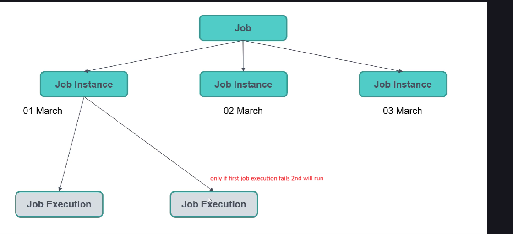

- job : complete batch process
- job-Instance: running instance of job , run only once
  - if scheduled every day run once every day
  - if it is failed due to any reason we can re-run it and new job instance created
  - if we want to every multiple times then we have to give different job parameters
  - 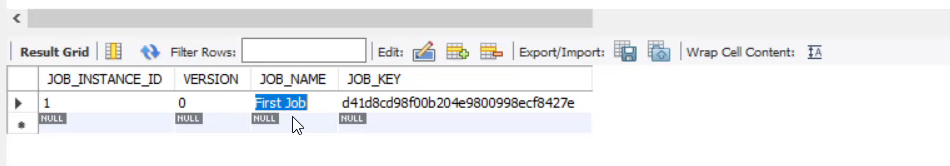
- job-execution: holds data of job details (start time, end time and status)
    - 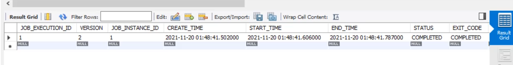
- job-execution-context: maps execution id
  - 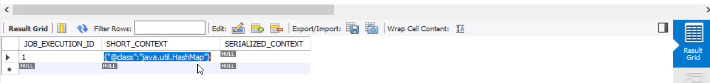
</details>

<details>
<summary>step execution</summary>

 - step-execution: spring batch stores step level information 
   - step level data, start , end and status
 - step-execution-context: map (key value) which stores step information
</details>

<details>
<summary>steps</summary>

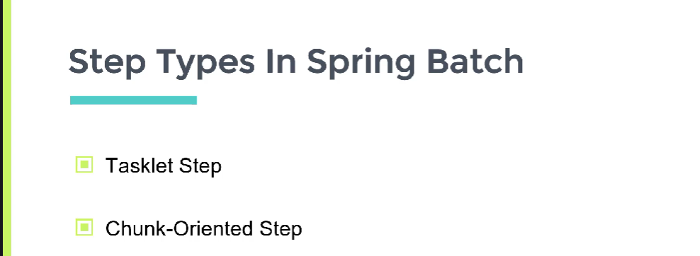

1. Tasklet step
    - 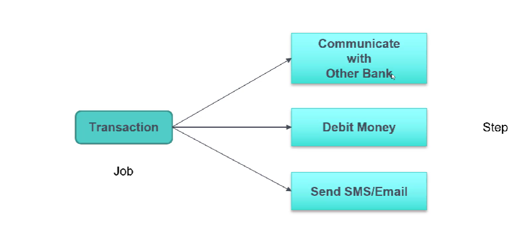
    - each task is independent  doesnt invole any reading bulk data and procesing
2. Chunk-oriented step:
    - 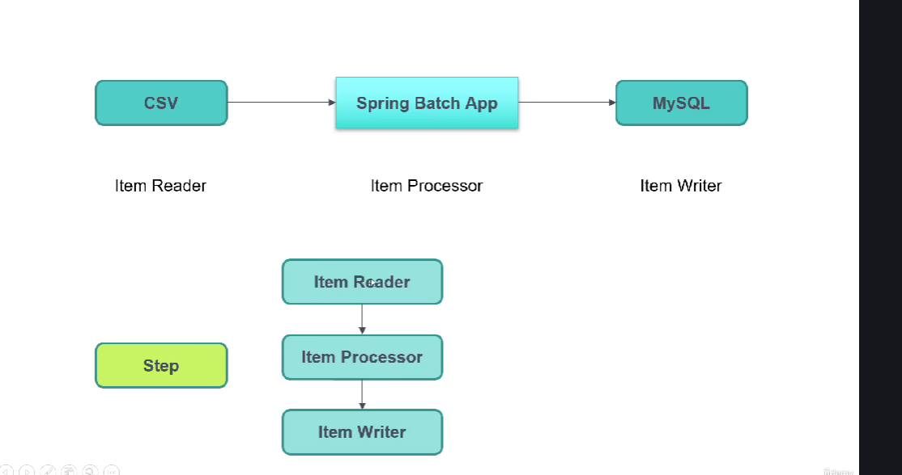
    - here we have million of records in one csv , we can read all at once
    - we divide it into multiple chunks based on chunk size
    - if chunk size is 10
    - at a time 10 records will read process and write 
    - once those 10 completed next chunk will staart
</details>


<details>
<summary>batch architecture</summary>

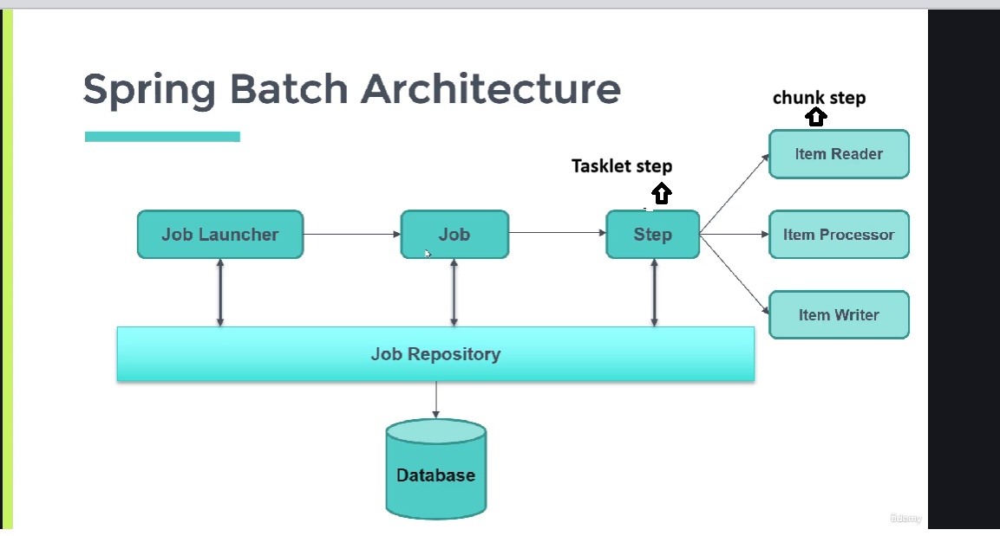

- job-launcher : used to run job 
</details>


<details>
<summary>first tasklet job</summary>

- add dependencies spring-batch and  any sql(mysql) (one sql is mandatory)
- 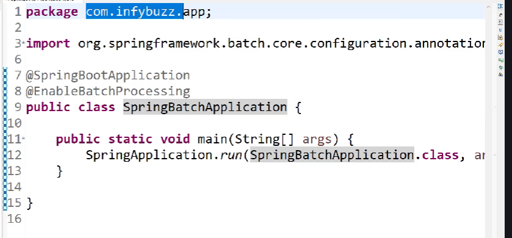
- 
```java
@Configuration
public class taskletJobConfig {
    @Autowired
    private JobBuilderFactory jobBuilderFactory;

    @Autowired
    private StepBuilderFactory stepBuilderFactory;

    @Autowired
    private secondTask secondTask; // task using external class

    @Autowired
    private TaskletListener taskletListener;

    @Autowired
    private TaskletStepListener taskletStepListener;

    @Bean
    public Job firstTaskletJob(){
       return jobBuilderFactory.get("firstTaskletJob") // job name
               .incrementer(new RunIdIncrementer()) // job parameter incremeter for unique jobs 
               .listener(taskletListener) // to intercept jobs , before and after
               .start(taskletFirstStep())  // first task will use start
                .next(taskletSecondStep())  // from second task will give next any anumber of tasks
                .build();
    }

    private Step taskletFirstStep(){  // first step
        return  stepBuilderFactory.get("firstTaskletStep")
                .listener(taskletStepListener) // to intercept steps , before and after
                .tasklet(firstTask())
                .build();
    }

    private Step taskletSecondStep(){
        return  stepBuilderFactory.get("SecondTaskletStep")
                .tasklet(secondTask)  // second task , implements Tasklet
                .build();
    }

    private Tasklet firstTask(){
      return new Tasklet() {
          @Override
          public RepeatStatus execute(StepContribution stepContribution, ChunkContext chunkContext) throws Exception {
              System.out.println("First Tasklet step");
              return RepeatStatus.FINISHED;
          }
      };
    }

    

}

```

```java
@Service
public class secondTask implements Tasklet{
    @Override
    public RepeatStatus execute(StepContribution stepContribution, ChunkContext chunkContext) throws Exception {
        System.out.println("second Tasklet step");
        return RepeatStatus.FINISHED;
    }
}
```
</details>


<details>
<summary>job parameters</summary>

- 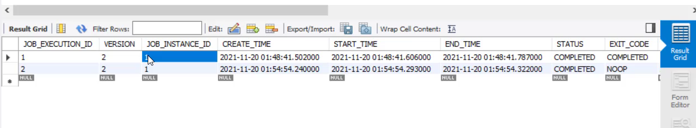
- if you run same job again above job id is same it wont run exit_code =NOOP
- if we want to run it again we have to use diffrent job parameters
- 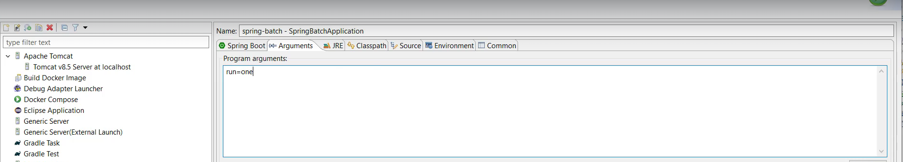
- 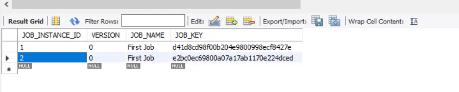
- 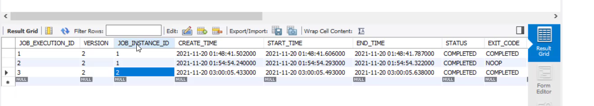
- 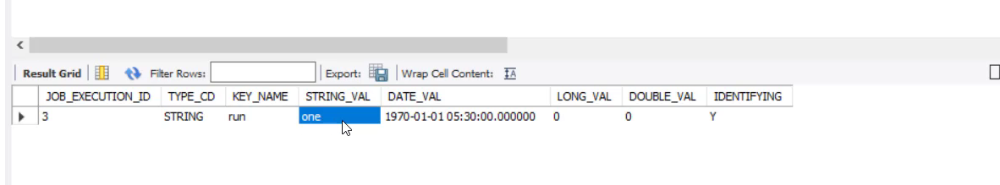
- 

</details>

<details>
<summary>job execution listener</summary>

 - to intercepts  jobs before and after job execution
 - 
```java
@Component
public class TaskletListener implements JobExecutionListener {

    @Override
    public void beforeJob(JobExecution jobExecution) {
        System.out.println("before Job Execution: "+jobExecution.getExecutionContext());
    }

    @Override
    public void afterJob(JobExecution jobExecution) {
        System.out.println("After Job Execution: "+jobExecution.getExecutionContext());
    }
}
```

 - 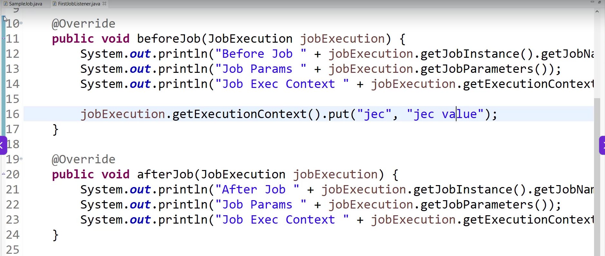
 - 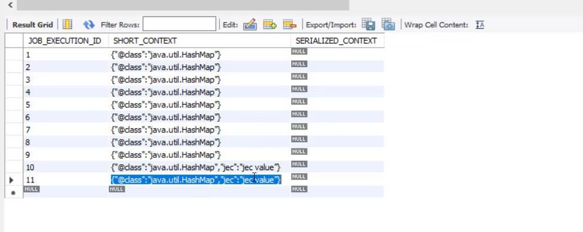
</details>


=================================================================================================
## Chunk Oriented steps


<details>
<summary>chunk basic step</summary>

- 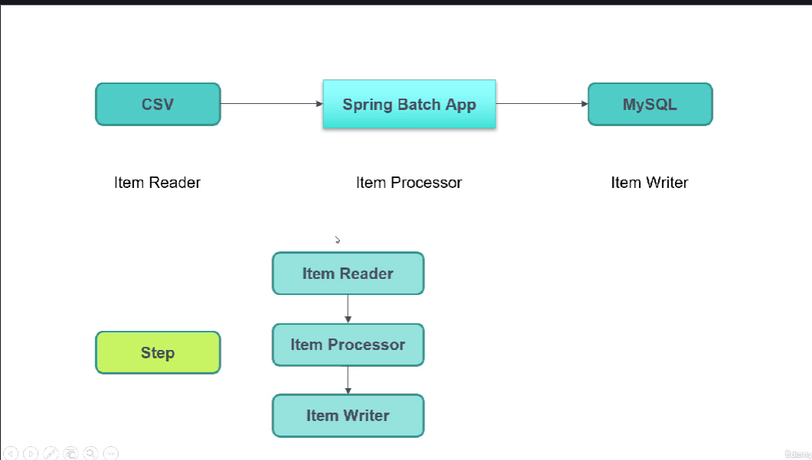
- 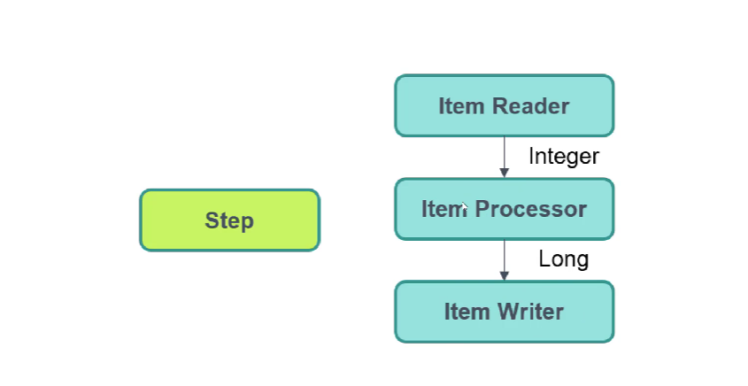
- 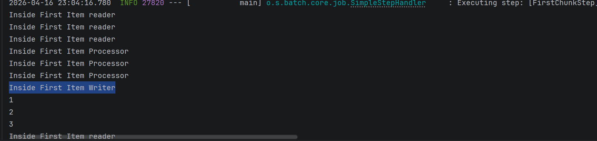

- reader  **org.springframework.batch.item.**ItemProcessor;
```java
@Component
public class FirstItemReader implements ItemReader<Integer> {
    List<Integer> list = Arrays.asList(1,2,3,4,5,6,7,8,9,10);
    int i=0;

    @Override
    public Integer read() throws Exception, UnexpectedInputException, ParseException, NonTransientResourceException {
        System.out.println("Inside First Item reader");
        Integer item;
        if(i<list.size()){
            item = list.get(i);
            i++;
            return item;
        }
        i=0;
        return null; //todo  means end of reader
    }
}
```
- processor

```java
@Component
public class FirstItemProcessor implements ItemProcessor<Integer,Long> {

    @Override
    public Long process(Integer integer) throws Exception {
        System.out.println("Inside First Item Processor");
        return Long.valueOf(integer);
    }
}
```
- writer

```java
@Component
public class FirstItemWriter  implements ItemWriter<Long> {
    @Override
    public void write(List<? extends Long> list) throws Exception {
        System.out.println("Inside First Item Writer");

        for(Long i : list){
            System.out.println(i);
        }
    }
}
```

- config

```java
@Configuration
public class chunkConfig {

    @Autowired
    private JobBuilderFactory jobBuilderFactory;

    @Autowired
    private StepBuilderFactory stepBuilderFactory;

    @Autowired
    private FirstItemReader firstItemReader;

    @Autowired
    private FirstItemProcessor firstItemProcessor;

    @Autowired
    private FirstItemWriter firstItemWriter;

    @Bean
    public Job firstChunkJob(){
        return jobBuilderFactory.get("FirstChunkJob")
                .incrementer(new RunIdIncrementer())
                .start(firstChunkStep())
                .build();
    }

    private Step firstChunkStep(){
        return stepBuilderFactory.get("FirstChunkStep")
                .<Integer,Long>chunk(3) //todo chunk size 3 items will read once
                .reader(firstItemReader)
                .processor(firstItemProcessor)
                .writer(firstItemWriter)
                .build();
    }
}
```
</details>


<details>
<summary>Job running</summary>

1. At time of application startup 
    - spring.batch.job.enabled = true
    - spring.batch.job.enabled = false (wont run at startup)

2. Rest way
   - controller
 ```java

@RestController
@RequestMapping("/job")
public class RestJobLauncherController {


    @Autowired
    JobChunkService jobChunkService;

    @Autowired
    JobOperator jobOperator;

    @GetMapping("/start/{jobName}")
    public String startJob(@PathVariable String jobName,
                           @RequestBody List<JobParamsRequest> jobParamsRequestList) throws JobInstanceAlreadyCompleteException, JobExecutionAlreadyRunningException, JobParametersInvalidException, JobRestartException {
        jobChunkService.startJob(jobName, jobParamsRequestList);

        return "Job Started";
    }

    @GetMapping("/stop/{executionId}")
    public String stopJob(@PathVariable long executionId) throws NoSuchJobExecutionException, JobExecutionNotRunningException {
        jobOperator.stop(executionId);

        return "Job Stopped";
    }
}
```
  - service
```java
@Service
public class JobChunkService {
    @Autowired
    JobLauncher jobLauncher;

    @Qualifier("firstChunkJob")
    @Autowired
    Job firstChunkJob;

    @Async
    public void startJob(String jobName, List<JobParamsRequest> jobParamsRequestList) throws JobInstanceAlreadyCompleteException, JobExecutionAlreadyRunningException, JobParametersInvalidException, JobRestartException {
        Map<String, JobParameter> hm = new HashMap<>();
        hm.put("Timestamp", new JobParameter(System.currentTimeMillis()));
        //todo to make this job unique everytime we run

        jobParamsRequestList.forEach(p -> {
            hm.put(p.getParamKey(), new JobParameter(p.getParamValue()));
        });
        JobParameters jobParameters = new JobParameters(hm);

        JobExecution jobExecution = null;
        if (jobName.equalsIgnoreCase("FirstChunkJob"))
            jobExecution = jobLauncher.run(firstChunkJob, jobParameters);

        if (jobExecution != null)
            System.out.println("job done " + jobExecution.getId());
    }
}
```
 - request
```java
public class JobParamsRequest {

    private String paramKey;
    private String paramValue;

```
 - for async @EnableAsync
   
3. Scheduler
 - for scheduling @EnableScheduling
```java
@Service
public class JobScheduler {
    @Autowired
    JobLauncher jobLauncher;

    @Qualifier("firstChunkJob")
    @Autowired
    Job firstChunkJob;

    @Scheduled(cron = "0 6 * * *")
    public void startJob() throws JobInstanceAlreadyCompleteException, JobExecutionAlreadyRunningException, JobParametersInvalidException, JobRestartException {
        Map<String, JobParameter> hm = new HashMap<>();
        hm.put("Timestamp", new JobParameter(System.currentTimeMillis()));
        //todo to make this job unique everytime we run

        JobParameters jobParameters = new JobParameters(hm);

        JobExecution jobExecution = null;

        jobExecution = jobLauncher.run(firstChunkJob, jobParameters);

        System.out.println("job done " + jobExecution.getId());
    }
}
```
</details>


<details>
<summary>Item Readers</summary>

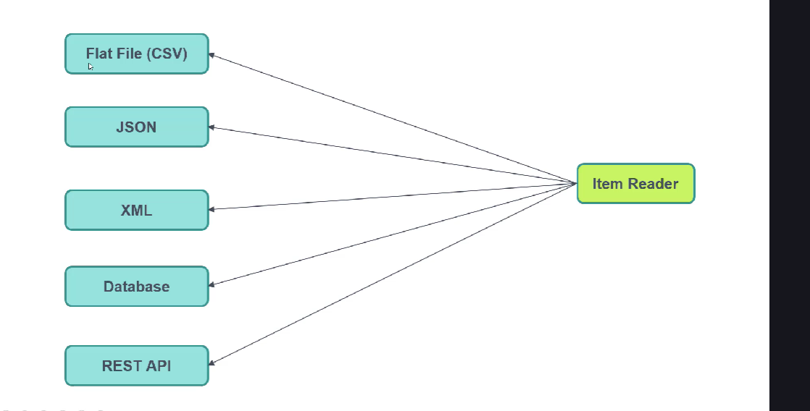

1. Flat File Item Reader (csv)
 
 - 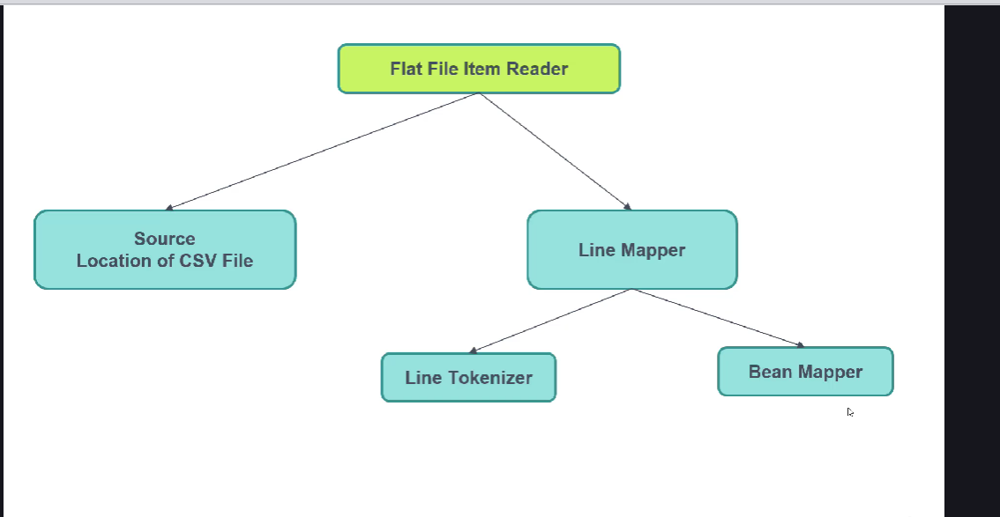
 - 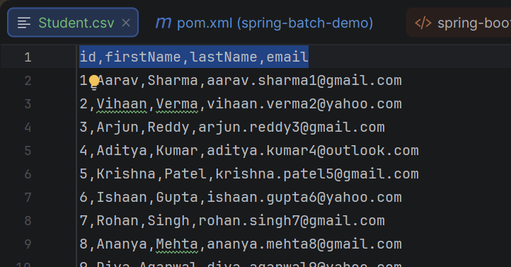
 - studentCSV
```java
public class StudentCSV {
    private int id;
    private String firstName;
    private String lastName;
    private String email;
}
```
 - config
```java
@Bean
    public Job csvChunkJob(){
        return jobBuilderFactory.get("csvChunkJob")
                .incrementer(new RunIdIncrementer())
                .start(firstChunkStep())
                .build();
    }

    private Step csvChunkStep(){
        return stepBuilderFactory.get("csvChunkStep")
                .<StudentCSV,StudentCSV>chunk(3) //todo chunk size 3 items will read once
                .reader(flatFileItemReader(null))
                //.processor(firstItemProcessor)
                //.writer(firstItemWriter)
                .build();
    }

    @StepScope //todo new bean for every step scope
    @Bean   //todo both are required since we are passing path using value
    public FlatFileItemReader<StudentCSV> flatFileItemReader(
    @Value("#{jobParameters['input']}") FileSystemResource fileSystemResource
    ){

        FlatFileItemReader<StudentCSV> fileItemReader = new FlatFileItemReader<>();
       /* fileItemReader.setResource(new FileSystemResource(
                "C:\\Users\\kodep\\IdeaProjects\\spring-batch-demo\\inputFiles\\Student.csv"
        ));*/

        fileItemReader.setResource(fileSystemResource);//todo instead of hardcoding placed it in jobParameters

       /*
        id,firstName,lastName,email
        1,Aarav,Sharma,aarav.sharma1@gmail.com
        2,Vihaan,Verma,vihaan.verma2@yahoo.com
        */
        DefaultLineMapper<StudentCSV> defaultLineMapper = new DefaultLineMapper<>();

        DelimitedLineTokenizer delimitedLineTokenizer = new DelimitedLineTokenizer();
        delimitedLineTokenizer.setNames("id","firstName","lastName","email");


        defaultLineMapper.setLineTokenizer(delimitedLineTokenizer);

        BeanWrapperFieldSetMapper<StudentCSV> beanWrapperFieldSetMapper= new BeanWrapperFieldSetMapper<>();
        beanWrapperFieldSetMapper.setTargetType(StudentCSV.class);
        defaultLineMapper.setFieldSetMapper(beanWrapperFieldSetMapper);

        fileItemReader.setLineMapper(defaultLineMapper);
        fileItemReader.setLinesToSkip(1);
        return fileItemReader;
    }
```
</details>