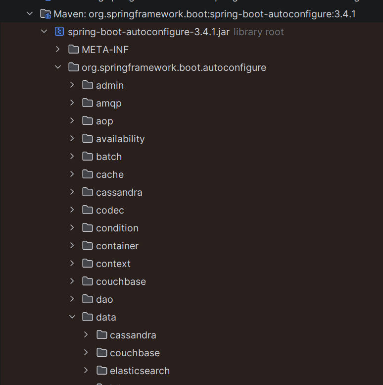
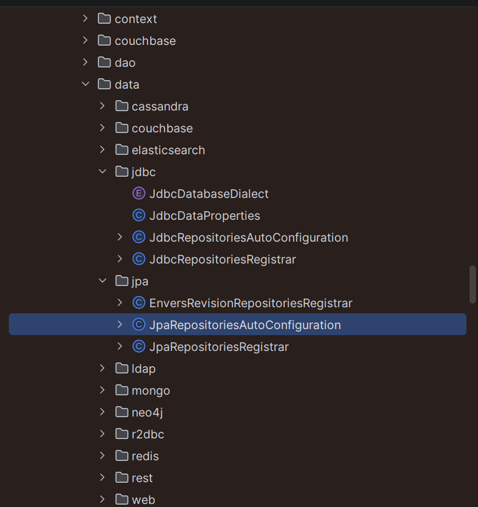
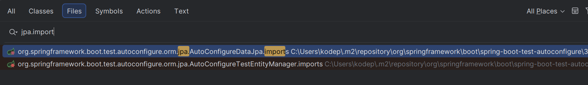
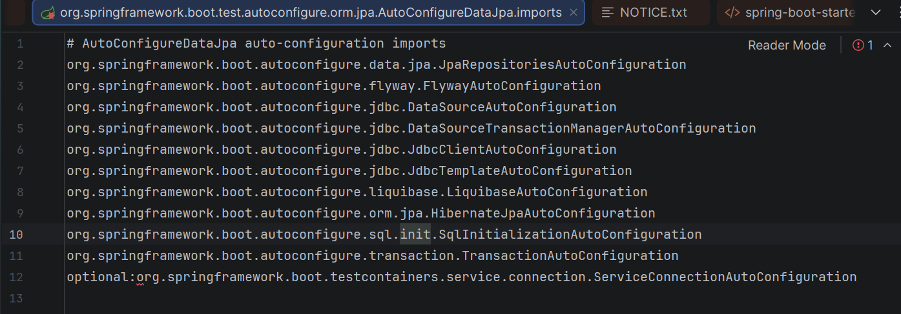

<details>
<summary>why spring boot </summary>

```text
Before Boot, in pure Spring:
    You had to configure DispatcherServlet
    Configure ComponentScan
    Configure DataSource
    Configure TransactionManager
    Configure ViewResolver
    Write XML or heavy Java config
    Deploy WAR to external Tomcat
```
```text
Spring Boot = Spring + opinionated defaults + automation around configuration
```
```text
A layer on top of Spring that eliminates boilerplate configuration using:
   1. Auto-configuration
   2. Conditional bean registration
   3. Classpath scanning
   4. Embedded container support
```
</details>

<details>
<summary>auto configuration</summary>

```text
Question 1:
When you add:
spring-boot-starter-data-jpa dependecny

How does Spring Boot know to create:
    EntityManagerFactory
    DataSource
    TransactionManager
```

```text
from spring-boot-autoconfigure
it contains all configurations for each dependency 
and these configuration  classes contain the actual bean creation logic.
```



```text
How does Spring Boot even KNOW these AutoConfiguration classes exist?

- it uses metadata files, not component scanning.

In Spring Boot 2.x:
    META-INF/spring.factories
            org.springframework.boot.autoconfigure.EnableAutoConfiguration=\
            org.springframework.boot.autoconfigure.jdbc.DataSourceAutoConfiguration,\
            org.springframework.boot.autoconfigure.orm.jpa.HibernateJpaAutoConfiguration
            
In Spring Boot 3.x (Important for interviews)
    META-INF/spring/org.springframework.boot.autoconfigure.AutoConfiguration.imports


```

```text
When does Spring Boot read this metadata file?
    It happens during ApplicationContext initialization phase — 
        specifically when Boot processes @EnableAutoConfiguration.
        
where does these metadata files present?
    when you add dependecny like spring-boot-starter-data-jpa
    The metadata files are stored inside Spring Boot’s dependency JARs, not in your project.
    
```



```text
It creates ApplicationContext
It reads metadata file         
    --> contains only what auto confiurations to load
    --> once it got list of autoconfigurations
    --> it checks in spring boot autoconfigure class how to creates beans for it 
            --> Class exists?, Property exists?, Missing bean?
           
It loads all AutoConfiguration classes 
```


```text
Flow of Auto-Configuration

Step 1:
   spring boot reads --> AutoConfiguration.imports
step 2: 
   It loads each AutoConfiguration class.
     ex: DataSourceAutoConfiguration

Step 3:
    Before creating any bean, it checks conditions like:
        @ConditionalOnClass
        @ConditionalOnMissingBean
        @ConditionalOnProperty
        @ConditionalOnBean
    Only if conditions match → bean gets registered.
```

```text
If you define your own:
@Bean
public DataSource dataSource() { ... }

Will Spring Boot still create its own default DataSource?
-------------------------------------------------------

Spring Boot will NOT create its default bean
    because most auto-configurations are protected with:
 ** @ConditionalOnMissingBean

Auto-configuration backs off when user provides explicit configuration.
```
</details>


<details>
<summary>SpringBootApplication </summary>

```text
@SpringBootApplication =
    @Configuration
    @EnableAutoConfiguration
    @ComponentScan

```

```text
@EnableAutoConfiguration
    @Import(AutoConfigurationImportSelector.class)
    
    It imports a selector class.
    
    - Read metadata file and select auto-config classes
    
    AutoConfigurationImportSelector:
    Reads the metadata file (AutoConfiguration.imports in Boot 3)
    Collects all auto-configuration class names
    Filters them using conditions
    Returns the final list to be imported into the ApplicationContext
    It does NOT create beans itself.
    It only selects configuration classes.
```
</details>

<details>
<summary>flow</summary>

```text
Startup Flow:

        SpringApplication.run()
                |
        Environment is prepared (application.yml / application.properties loaded,Profiles resolved,Environment variables merged
                |
        Creates ApplicationContext
                |
        Processes @SpringBootApplication
                |
        @EnableAutoConfiguration triggers
                |
        AutoConfigurationImportSelector reads metadata
                |
        Auto-config classes get imported
                |
        Conditions evaluated
                |
        BeanDefinitions registered
                |
        Spring Core creates beans
        
That’s the real internal flow.
```
</details>

<details>
<summary>tomcat</summary>

```text
Embedded Tomcat starts during ApplicationContext refresh, not after everything is fully finished.

Now let’s make this very clear (interview gold).
    When SpringApplication.run() is called:
    ApplicationContext is created
    BeanDefinitions are loaded
    context.refresh() is called

During refresh:
    Beans are created
    ServletWebServerApplicationContext creates the web server
    Embedded Tomcat is initialized and started
    Context is marked as ready

So Tomcat starts inside the onRefresh() phase of:
    ServletWebServerApplicationContext
```

```text
Spring Boot decides the ApplicationContext type by detecting the WebApplicationType from the classpath.
If Servlet APIs are present → ServletWebServerApplicationContext
If only WebFlux present → ReactiveWebServerApplicationContext
If none present → AnnotationConfigApplicationContext
```

# Tomcat in Spring Boot – Complete Notes

## 1️⃣ What is Tomcat in Spring Boot?

Tomcat is an **embedded servlet container**.

It:

- Listens on a port (default **8080**)
- Accepts HTTP requests
- Converts them to `HttpServletRequest`
- Delegates to `DispatcherServlet`

In **Spring Boot**, Tomcat is **not external** — it runs **inside your JVM process**.

---

## 2️⃣ Where does Tomcat come from?

### Dependency:

</details>

