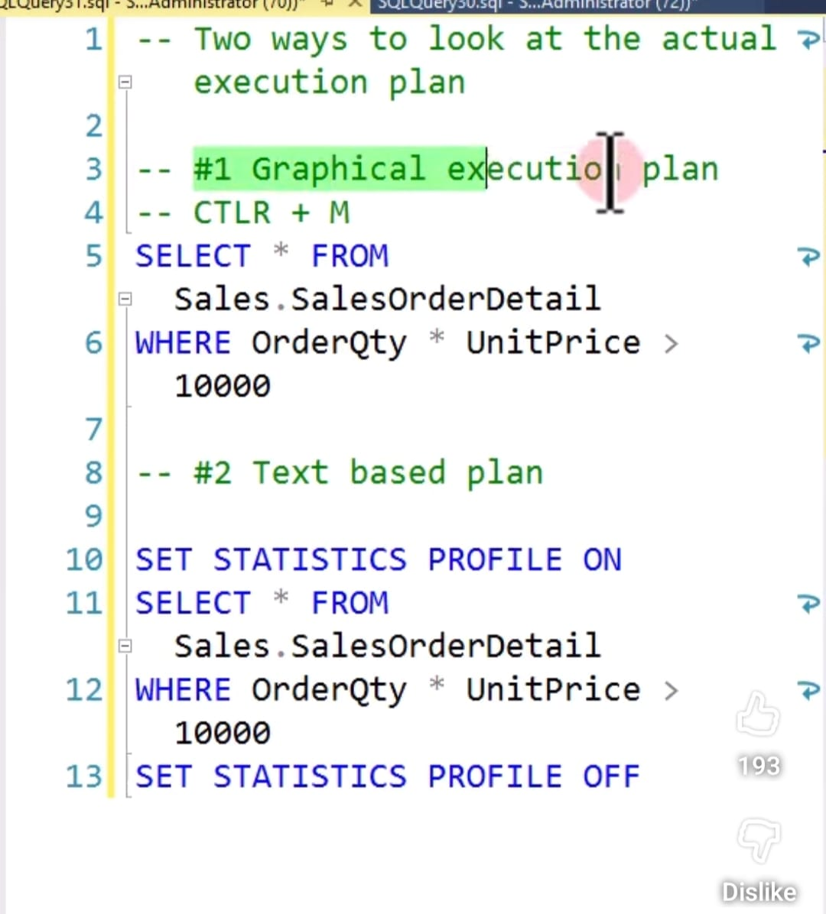
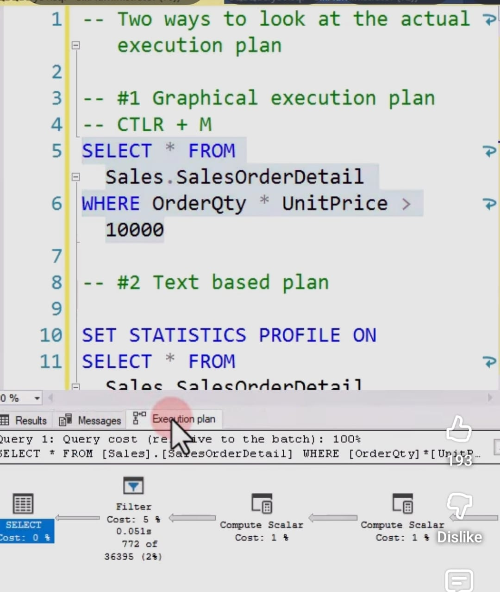
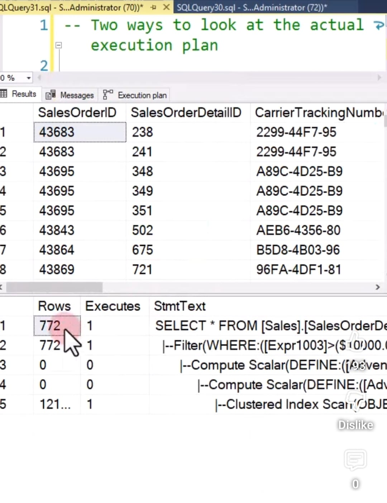

<details>
<summary>db purge</summary>

```text
why purge 

Large tables:
- Degrade query performance
- Increase IO cost          --> rows stored in pages  --> pages will be laoded  --> full table scan all pages loaded more io operation 
- Increase index size 
- Slow down write operations --> updated in table and all indexes
- Increase storage cost 

```
```text

batch delete

Reasons:
Avoid long-running transactions
Reduce lock contention         --> multiple rows got locked 
Prevent blocking
Control transaction log growth    --> each write operation saves data in transaction log , will be released only after commiting . (used for rollback if failures during transaction)
Reduce risk of log file filling up
Safer for production workloads
```

```text
chanllanges 
index:

we created index on facility number, country code, createdDateTS

Sometimes country code was ‘mx’ and ‘MX’, so we used UPPER(countryCode) in WHERE clause.
That caused index performance issue.
Later we normalized data to uppercase and updated schema.


Function on indexed column prevents index seek
  --> it search all rows and convert to upper case and checks data 
  --> so index wont work here
  
  


```



</details>